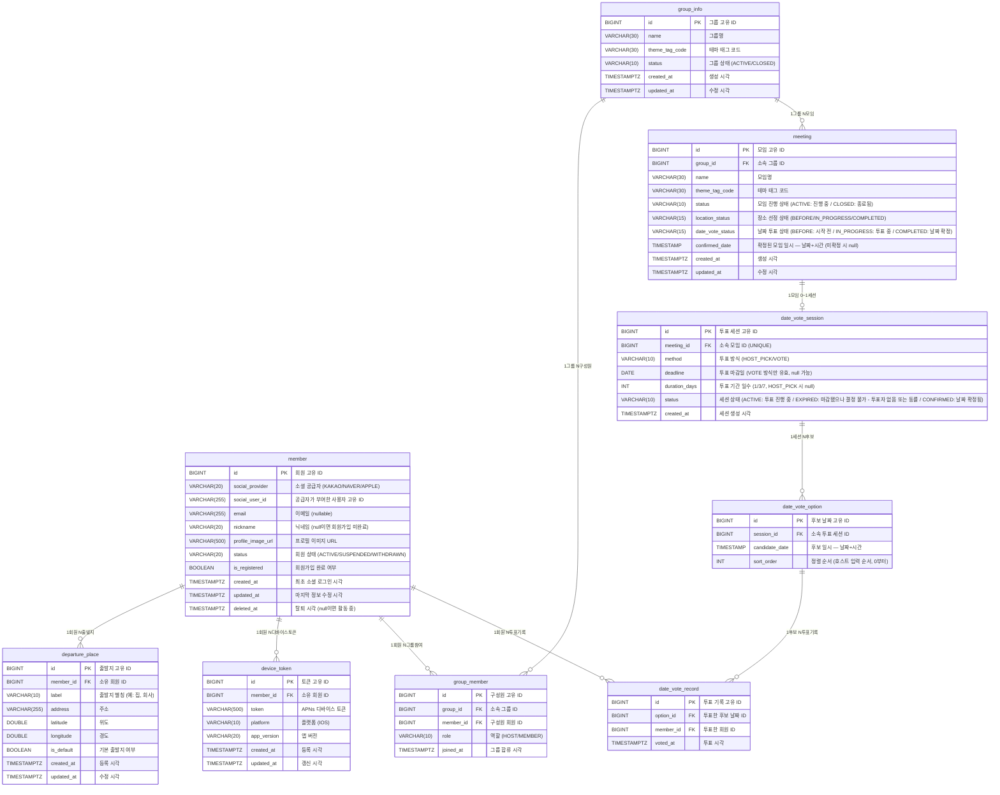

# ERD — FC-7 모임 상세 + 날짜 투표

```mermaid
erDiagram
    %% [기존] member
    member {
        BIGINT id PK "회원 고유 ID"
        VARCHAR(20) social_provider "소셜 공급자 (KAKAO/NAVER/APPLE)"
        VARCHAR(255) social_user_id "공급자가 부여한 사용자 고유 ID"
        VARCHAR(255) email "이메일 (nullable)"
        VARCHAR(20) nickname "닉네임 (null이면 회원가입 미완료)"
        VARCHAR(500) profile_image_url "프로필 이미지 URL"
        VARCHAR(20) status "회원 상태 (ACTIVE/SUSPENDED/WITHDRAWN)"
        BOOLEAN is_registered "회원가입 완료 여부"
        TIMESTAMPTZ created_at "최초 소셜 로그인 시각"
        TIMESTAMPTZ updated_at "마지막 정보 수정 시각"
        TIMESTAMPTZ deleted_at "탈퇴 시각 (null이면 활동 중)"
    }

    %% [기존] departure_place
    departure_place {
        BIGINT id PK "출발지 고유 ID"
        BIGINT member_id FK "소유 회원 ID"
        VARCHAR(10) label "출발지 별칭 (예: 집, 회사)"
        VARCHAR(255) address "주소"
        DOUBLE latitude "위도"
        DOUBLE longitude "경도"
        BOOLEAN is_default "기본 출발지 여부"
        TIMESTAMPTZ created_at "등록 시각"
        TIMESTAMPTZ updated_at "수정 시각"
    }

    %% [기존] device_token
    device_token {
        BIGINT id PK "토큰 고유 ID"
        BIGINT member_id FK "소유 회원 ID"
        VARCHAR(500) token "APNs 디바이스 토큰"
        VARCHAR(10) platform "플랫폼 (IOS)"
        VARCHAR(20) app_version "앱 버전"
        TIMESTAMPTZ created_at "등록 시각"
        TIMESTAMPTZ updated_at "갱신 시각"
    }

    %% [기존] group_info
    group_info {
        BIGINT id PK "그룹 고유 ID"
        VARCHAR(30) name "그룹명"
        VARCHAR(30) theme_tag_code "테마 태그 코드"
        VARCHAR(10) status "그룹 상태 (ACTIVE/CLOSED)"
        TIMESTAMPTZ created_at "생성 시각"
        TIMESTAMPTZ updated_at "수정 시각"
    }

    %% [기존] group_member (참석여부는 meeting_participant로 이전, V31에서 attendance_status 제거)
    group_member {
        BIGINT id PK "구성원 고유 ID"
        BIGINT group_id FK "소속 그룹 ID"
        BIGINT member_id FK "구성원 회원 ID"
        VARCHAR(10) role "역할 (HOST/MEMBER)"
        TIMESTAMPTZ joined_at "그룹 합류 시각"
    }

    %% [기존] meeting
    meeting {
        BIGINT id PK "모임 고유 ID"
        BIGINT group_id FK "소속 그룹 ID"
        VARCHAR(30) name "모임명"
        VARCHAR(30) theme_tag_code "테마 태그 코드"
        VARCHAR(10) status "모임 진행 상태 (ACTIVE: 진행 중 / CLOSED: 종료됨)"
        VARCHAR(15) location_status "장소 선정 상태 (BEFORE/IN_PROGRESS/COMPLETED)"
        VARCHAR(15) date_vote_status "날짜 투표 상태 (BEFORE: 시작 전 / IN_PROGRESS: 투표 중 / COMPLETED: 날짜 확정)"
        TIMESTAMP confirmed_date "확정된 모임 일시 — 날짜+시간 (미확정 시 null)"
        TIMESTAMPTZ created_at "생성 시각"
        TIMESTAMPTZ updated_at "수정 시각"
    }

    %% [FC-7 신규] date_vote_session
    date_vote_session {
        BIGINT id PK "투표 세션 고유 ID"
        BIGINT meeting_id FK "소속 모임 ID (UNIQUE)"
        VARCHAR(10) method "투표 방식 (HOST_PICK/VOTE)"
        DATE deadline "투표 마감일 (VOTE 방식만 유효, null 가능)"
        INT duration_days "투표 기간 일수 (1/3/7, HOST_PICK 시 null)"
        VARCHAR(10) status "세션 상태 (ACTIVE: 투표 진행 중 / EXPIRED: 마감됐으나 결정 불가 - 투표자 없음 또는 동률 / CONFIRMED: 날짜 확정됨)"
        TIMESTAMPTZ created_at "세션 생성 시각"
    }

    %% [FC-7 신규] date_vote_option
    date_vote_option {
        BIGINT id PK "후보 날짜 고유 ID"
        BIGINT session_id FK "소속 투표 세션 ID"
        TIMESTAMP candidate_date "후보 일시 — 날짜+시간"
        INT sort_order "정렬 순서 (호스트 입력 순서, 0부터)"
    }

    %% [FC-7 신규] date_vote_record
    date_vote_record {
        BIGINT id PK "투표 기록 고유 ID"
        BIGINT option_id FK "투표한 후보 날짜 ID"
        BIGINT member_id FK "투표한 회원 ID"
        TIMESTAMPTZ voted_at "투표 시각"
    }

    member ||--o{ departure_place : "1회원 N출발지"
    member ||--o{ device_token : "1회원 N디바이스토큰"
    member ||--o{ group_member : "1회원 N그룹참여"
    member ||--o{ date_vote_record : "1회원 N투표기록"
    group_info ||--o{ group_member : "1그룹 N구성원"
    group_info ||--o{ meeting : "1그룹 N모임"
    meeting ||--o| date_vote_session : "1모임 0~1세션"
    date_vote_session ||--o{ date_vote_option : "1세션 N후보"
    date_vote_option ||--o{ date_vote_record : "1후보 N투표기록"
```
