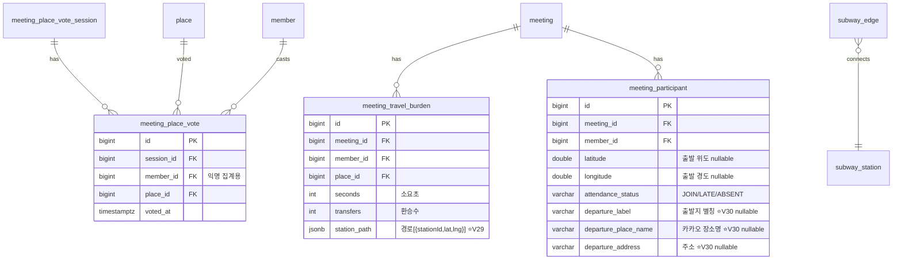

# ERD — FC-12 투표 + 이동부담

- V23: meeting_place_vote (UNIQUE session_id, member_id, place_id)
- V24: meeting_travel_burden (UNIQUE meeting_id, member_id, place_id)
- subway_edge(V17, 기존): 그래프 원본 — 부팅 시 메모리 로드
- ⭐ V28: `meeting_place_pick` 에 `source VARCHAR(10) DEFAULT 'USER'` 추가 + `member_id` nullable
  - 투표 후보 집합 = meeting_place_pick 전체(USER+SYSTEM)
  - 담기 현황/함께담기 N/완료 구성원 = source='USER' 만 (FC-9 참조)
- ⭐ V29: `meeting_travel_burden` 에 `station_path JSONB` 추가 (이동경로 스냅샷, 반정규화)
  - 값 = `[{stationId, latitude, longitude}, ...]` 출발→도착 순서. 친구들 거리보기 지도 표시용.
- ⭐ V30: `meeting_participant` 에 출발지 메타 3컬럼 추가 (`departure_label`, `departure_place_name`, `departure_address`, 모두 nullable)
  - 출발지 이름을 쓰기 시점 스냅샷으로 직접 저장(좌표 역매칭 폐기). 기본 출발지 기준 best-effort 백필.
