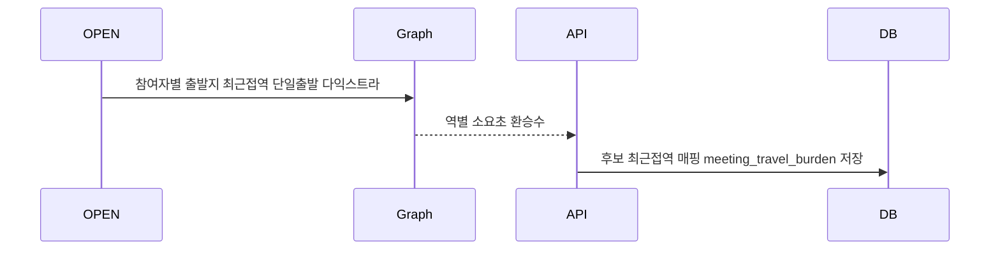

# 처리 흐름 — FC-12 투표 진행

## 이동부담 스냅샷(투표 시작 시 1회)

```mermaid
sequenceDiagram
    OPEN->>Graph: 참여자별 출발지 최근접역 단일출발 다익스트라
    Graph-->>API: 역별 소요초 환승수
    API->>DB: 후보 최근접역 매핑 meeting_travel_burden 저장
```

## 투표
1. submit: 다중제한 검증 → 익명 저장 → 1개이상=완료
2. 전원 투표완료 시 CONFIRMED 트리거(FC-13)
3. 마감 배치 시 CONFIRMED 트리거

## 상태 전이
- VOTING 유지 → (전원/마감) → CONFIRMED
