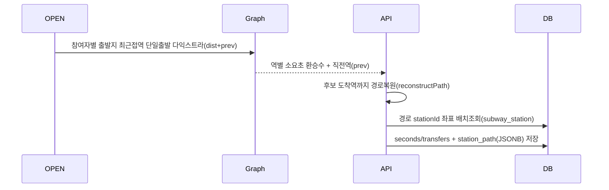

# 처리 흐름 — FC-12 투표 진행

## 이동부담 + 경로 스냅샷(투표 시작 시 1회) ⭐

- 경로 복원 = `prev` 역추적으로 출발역→도착역 순서 리스트.
- 도달 불가 시 경로 빈 리스트.
- 친구들 거리보기 조회 시 스냅샷 그대로 반환(재계산 없음).

## 친구들 거리보기 조회 ⭐ (2026-06-25 보강)
1. 모임 활성 참여자(ABSENT 제외) 전원을 멤버 기준으로 잡음(요청자 포함).
2. 해당 장소 burden 스냅샷 → memberId별 매핑(없는 멤버 허용).
3. 멤버 닉네임 + 출발지(DeparturePlace) 배치 조회.
4. 참여자별 조립: seconds/transfers/path(스냅샷) or null/[], isMe, departureName(좌표매칭→기본→null).
5. isLongest = 소요시간 보유 멤버 중 최대.

## 투표 시작 (백필 포함) ⭐
1. 후보(담긴 장소) distinct < 3 → 추천 rank순으로 SYSTEM 백필하여 3개 확보
2. 세션 생성 + 이동부담 스냅샷(담긴 후보 대상)
- 모든 시작 경로(호스트 수동/전원 담기/마감 자동) 공통

## 투표
1. submit: ⭐ placeId 후보소속 검증 + 담긴후보 50% 제한 → 익명 저장 → 1개이상=완료
2. 전원 투표완료 시 CONFIRMED 트리거(FC-13)
3. 마감 배치 시 CONFIRMED 트리거
4. ⭐ 호스트 수동 확정도 가능(FC-13 place-confirm)

## 상태 전이
- VOTING 유지 → (전원/마감/호스트수동) → CONFIRMED
