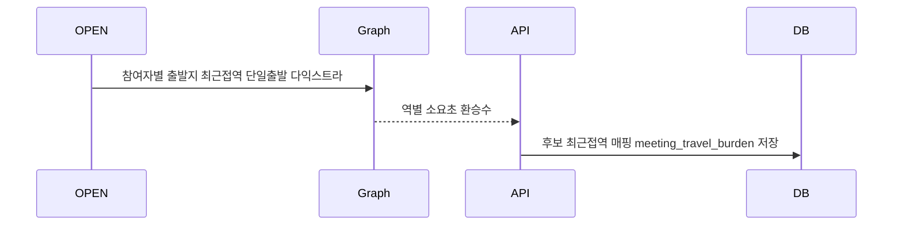

# 처리 흐름 — FC-12 투표 진행

## 이동부담 스냅샷(투표 시작 시 1회)

## 투표 시작 (백필 포함) ⭐
1. 후보(담긴 장소) distinct < 3 → 추천 rank순으로 SYSTEM 백필하여 3개 확보
2. 세션 생성 + 이동부담 스냅샷(담긴 후보 대상)
- 모든 시작 경로(호스트 수동/전원 담기/마감 자동) 공통

## 투표
1. submit: ⭐ placeId 후보소속 검증 + 담긴후보 50% 제한 → 익명 저장 → 1개이상=완료
2. 전원 투표완료 시 CONFIRMED 트리거(FC-13)
3. 마감 배치 시 CONFIRMED 트리거
4. ⭐ 호스트 수동 확정도 가능(FC-13 place-confirm)

## 상태 전이
- VOTING 유지 → (전원/마감/호스트수동) → CONFIRMED
