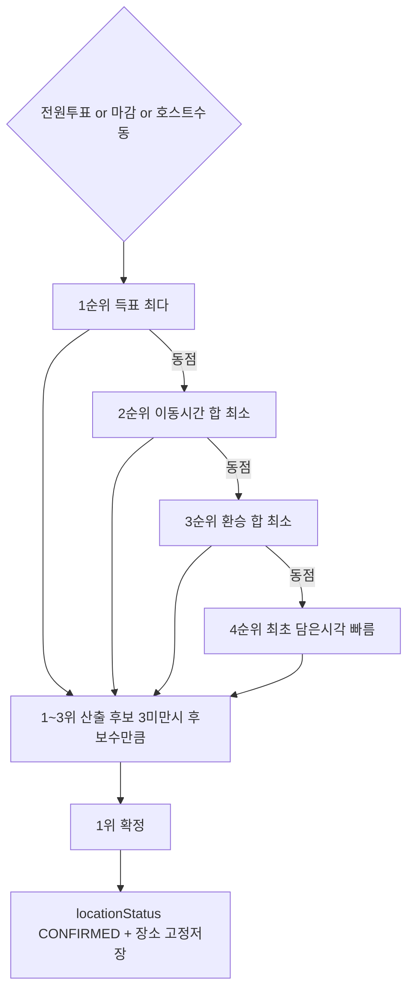

# 처리 흐름 — FC-13 자동 확정

## 단계
1. 트리거(전원/마감/호스트수동) ⭐
2. meeting_place_vote 집계 + meeting_travel_burden 합산 + 후보별 min picked_at ⭐
3. 공통 비교자로 1위 결정 + 1~3위 산출(전원기권 → 최초 담은시각) ⭐
4. meeting_confirmed_place 저장 + CONFIRMED
5. 결과 조회 시 동일 비교자로 candidates rank 부여 ⭐

## 상태 전이
- VOTING → CONFIRMED
