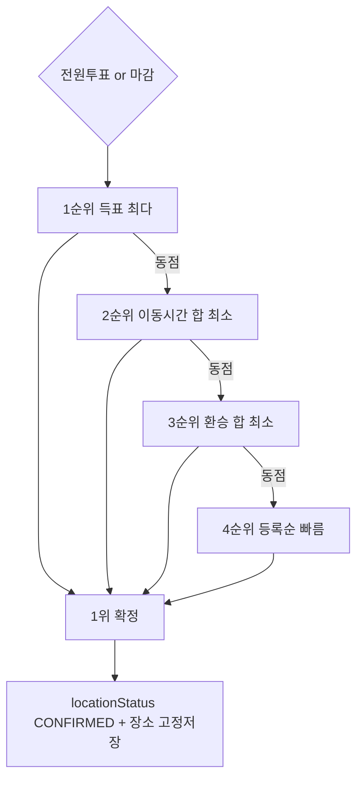

# 처리 흐름 — FC-13 자동 확정

```mermaid
flowchart TD
    T{전원투표 or 마감} --> R1[1순위 득표 최다]
    R1 -->|동점| R2[2순위 이동시간 합 최소]
    R2 -->|동점| R3[3순위 환승 합 최소]
    R3 -->|동점| R4[4순위 등록순 빠름]
    R1 --> SAVE[1위 확정]
    R2 --> SAVE
    R3 --> SAVE
    R4 --> SAVE
    SAVE --> ST[locationStatus CONFIRMED + 장소 고정저장]
```

## 단계
1. 트리거(전원/마감)
2. meeting_place_vote 집계 + meeting_travel_burden 합산
3. 4단계 순위로 1위 결정(전원기권 → 등록순)
4. meeting_confirmed_place 저장 + CONFIRMED

## 상태 전이
- VOTING → CONFIRMED
