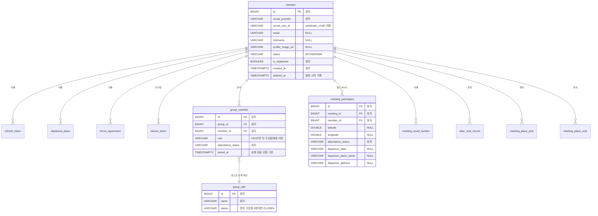

# ERD — FC-14 회원 탈퇴

> 2026-08-24 신규. **스키마 변경 없음.** 기존 컬럼(`status`, `deleted_at`)만 활용하므로 Flyway 마이그레이션이 발생하지 않는다.

---

## 1. 탈퇴가 영향을 주는 테이블 관계



### 텍스트 대안

```
member (뼈대 유지, 개인정보 5필드 익명화)
 |
 +-- refresh_token ............ DELETE
 +-- departure_place .......... DELETE
 +-- terms_agreement .......... DELETE
 +-- meeting_travel_burden .... DELETE
 |
 +-- meeting_participant ...... 행 유지 / 좌표 2 + 출발지 메타 3 = NULL
 |
 +-- group_member ............. 행 유지 (HOST면 타인에게 역할 이전)
 |     └-- group_info ......... 잔여 구성원 0명이면 status=CLOSED
 |
 +-- date_vote_record ......... 유지
 +-- meeting_place_pick ....... 유지
 +-- meeting_place_vote ....... 유지
 |
 +-- device_token ............. 자바 코드 미구현 → 이번 범위 제외
                                (푸시 구현 시 DELETE 추가 필수)
```

---

## 2. 컬럼별 처리 상세

### member (익명화)

| 컬럼 | 타입 | 탈퇴 후 값 | 비고 |
|---|---|---|---|
| `id` | BIGINT PK | 유지 | FK 무결성 유지용 뼈대 |
| `social_provider` | VARCHAR(20) | 유지 | 식별 불가 (KAKAO/NAVER/APPLE) |
| `social_user_id` | VARCHAR(255) NOT NULL | `withdrawn_{UUID}` | **NOT NULL 이라 NULL 불가 → 난수 치환** |
| `email` | VARCHAR(255) | `NULL` | nullable |
| `nickname` | VARCHAR(20) | `NULL` | nullable |
| `profile_image_url` | VARCHAR(500) | `NULL` | nullable. GCS 객체도 별도 삭제 |
| `status` | VARCHAR(20) | `WITHDRAWN` | 기존 enum 값 사용 |
| `is_registered` | BOOLEAN | 유지 | |
| `deleted_at` | TIMESTAMPTZ | `now()` | V2에 이미 존재하던 미사용 컬럼 활용 |

> `uk_member_social UNIQUE (social_provider, social_user_id)` 제약이 있으므로 치환값은 UUID로 충돌을 회피한다.

### meeting_participant (부분 NULL)

| 컬럼 | Nullable | 탈퇴 후 |
|---|---|---|
| `latitude` / `longitude` | O (V15에서 전환) | `NULL` |
| `departure_label` / `departure_place_name` / `departure_address` | O (V30) | `NULL` |
| `meeting_id` / `member_id` / `attendance_status` | X | 유지 |

> 좌표가 V15에서 이미 nullable로 전환되어 있어 **제약 변경이 불필요**하다.

---

## 3. 마이그레이션

**없음.** 아래 이유로 신규 Flyway 스크립트가 발생하지 않는다.

| 필요 요소 | 기존 위치 |
|---|---|
| `member.status` = WITHDRAWN | V2 (enum 값 이미 정의) |
| `member.deleted_at` | V2 (미사용 상태로 존재) |
| `meeting_participant` 좌표 nullable | V15 |
| `meeting_participant` 출발지 메타 nullable | V30 |
