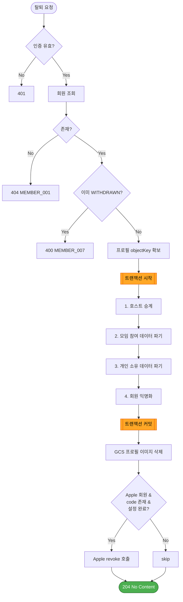
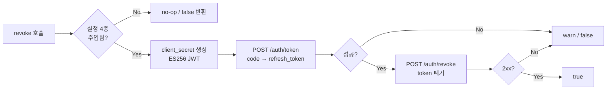

# 처리 흐름 — FC-14 회원 탈퇴

> 2026-08-24 신규.

---

## 1. `DELETE /api/v1/members/me` — 전체 흐름



### 텍스트 대안

```
1. 인증 검증          → 실패 401
2. 회원 조회          → 없으면 404 MEMBER_001
3. 탈퇴 여부 확인     → 이미 탈퇴면 400 MEMBER_007
4. 프로필 objectKey 확보 (익명화 전에 미리 보관)
--- 트랜잭션 시작 ---
5. 호스트 승계
6. 모임 참여 데이터 파기
7. 개인 소유 데이터 파기
8. 회원 익명화
--- 트랜잭션 커밋 ---
9. GCS 프로필 이미지 삭제 (실패해도 진행)
10. Apple revoke        (조건 미충족 시 skip, 실패해도 진행)
11. 204 No Content
```

---

## 2. 단계별 상세

### 5. 호스트 승계 — **가장 먼저 수행**

```
targetGroups = groupMemberRepository.findByMemberId(memberId)
                 .filter(role == HOST)

for each group in targetGroups:
    candidates = groupMemberRepository.findByGroupId(group.groupId)
                   .filter(memberId != 탈퇴자)
                   .sortBy(joinedAt ASC)

    if candidates.isEmpty():
        group.close()            → group_info.status = CLOSED
        groupRepository.save(group)
    else:
        candidates[0].promoteToHost()   → group_member.role = HOST
        groupMemberRepository.save(candidates[0])
```

> **순서가 중요한 이유**: 회원 익명화(8단계)가 먼저 실행되면 승계 후보 판정 시 탈퇴자를 정상 회원으로 오인할 여지가 있다.

### 6. 모임 참여 데이터 파기

```
participants = meetingParticipantRepository.findByMemberId(memberId)
participants.forEach(p -> p.clearDeparture())
    → latitude, longitude, departure_label,
      departure_place_name, departure_address = NULL
meetingParticipantRepository.saveAll(participants)

meetingTravelBurdenRepository.deleteAllByMemberId(memberId)
    → 이동 소요시간·환승·station_path 스냅샷 제거
```

### 7. 개인 소유 데이터 파기

```
departurePlaceRepository.deleteAllByMemberId(memberId)
termsAgreementRepository.deleteAllByMemberId(memberId)
refreshTokenRepository.deleteAllByMemberId(memberId)
```

> `device_token` 은 자바 코드 미구현으로 이번 범위 제외. **푸시 알림 구현 시 이 단계에 추가 필수** (`fc14/rules.md` §F)

### 8. 회원 익명화

```
member.withdraw("withdrawn_" + UUID.randomUUID())
    → status = WITHDRAWN
      deletedAt = now()
      nickname / email / profileImageUrl = null
      socialUserId = withdrawn_{UUID}
memberRepository.save(member)
```

### 9~10. 트랜잭션 외부 (best-effort)

```
9.  if objectKey != null && objectKey.startsWith("profiles/"):
        storageService.delete(objectKey)     실패 → warn 로그, 계속 진행

10. if provider == APPLE && appleCode != null && 설정 4종 완비:
        appleTokenRevoker.revoke(appleCode)  실패 → warn 로그, 계속 진행
    else:
        skip (INFO 로그)
```

---

## 3. Apple revoke 내부 흐름



### 텍스트 대안

```
1. 설정(Team ID / Key ID / .p8 / Client ID) 미주입 → no-op, false
2. client_secret JWT 생성
     header : alg=ES256, kid=<Key ID>
     payload: iss=<Team ID>, sub=<Client ID>,
              aud=https://appleid.apple.com, iat, exp(+5m)
3. POST https://appleid.apple.com/auth/token
     grant_type=authorization_code + code + client_id + client_secret
     → refresh_token
4. POST https://appleid.apple.com/auth/revoke
     token + token_type_hint=refresh_token + client_id + client_secret
5. 2xx → true / 그 외·예외 → warn 로그 후 false (예외 전파 금지)
```

---

## 4. 상태 전이

### 회원 상태

```
ACTIVE ──(탈퇴 요청)──> WITHDRAWN   [종료 상태, 복구 없음]

SUSPENDED ──(탈퇴 요청)──> WITHDRAWN
```

- `WITHDRAWN` → 다른 상태로의 전이는 없다 (관리자 복구 기능 미제공)
- 동일 소셜 계정 재로그인 시 **별도의 새 member 행이 `ACTIVE` 로 생성**된다 (기존 행 재활용 아님)

### 그룹 상태 (호스트 탈퇴 시)

```
ACTIVE ──(호스트 탈퇴 + 잔여 구성원 0명)──> CLOSED
ACTIVE ──(호스트 탈퇴 + 잔여 구성원 1명 이상)──> ACTIVE (호스트만 교체)
```

### 그룹 구성원 역할

```
탈퇴자    : HOST ──> MEMBER (행 유지, 삭제 안 함)
승계 대상 : MEMBER ──> HOST
```

---

## 5. 탈퇴 이후 조회 동작

| 시나리오 | 동작 |
|---|---|
| 탈퇴자의 Access Token으로 API 호출 | 인증 필터가 상태 확인 → 401 (만료 대기 없음) |
| 다른 구성원이 그룹 구성원 목록 조회 | 탈퇴자는 `nickname`·`profileImageUrl` = `null` |
| 다른 구성원이 중간지점 조회 | 탈퇴자 좌표는 `ST_Collect` 가 자동 제외 → 남은 인원으로 재계산 |
| 이동부담 계산 (신규 투표 세션) | `hasCoordinate()` 필터로 탈퇴자 자동 제외 |
| 친구들 거리보기 | 탈퇴자는 `seconds`·`transfers` = `null`, `path` = `[]` |
| 진행 중 투표 집계 | 탈퇴자의 표·담기 기록 유지 → 집계 결과 불변 |
| 동일 소셜 계정 재로그인 | 신규 회원 생성 → 회원가입 플로우 진입 (`firstSocialLogin=true`) |

---

## 6. 실패 시나리오

| 실패 지점 | 처리 |
|---|---|
| 트랜잭션 내 임의 단계 | 전체 롤백. 부분 파기 상태를 남기지 않음 |
| GCS 이미지 삭제 실패 | 탈퇴 유지. warn 로그. 고아 객체는 수동/후속 배치 정리 |
| Apple revoke 실패 | 탈퇴 유지. warn 로그. 사용자 Apple 계정에 연결이 남을 수 있음 |
| `X-Apple-Authorization-Code` 미전달 | revoke skip, 탈퇴 정상 진행 (차단 시 App Store 5.1.1(v) 위반) |
| Apple 자격증명 미설정 (로컬/테스트) | revoke skip, 탈퇴 정상 진행 |
