# ERD — FC-6 모임 리스트

> FC-6은 신규 테이블 없음. 기존 테이블(FC-4까지)을 조회 전용으로 사용합니다.

```mermaid
erDiagram
    %% [기존] member
    member {
        BIGINT id PK "회원 고유 ID"
        VARCHAR(20) social_provider "소셜 공급자 (KAKAO/NAVER/APPLE)"
        VARCHAR(255) social_user_id "공급자가 부여한 사용자 고유 ID"
        VARCHAR(255) email "이메일 (애플은 비공개 가능, nullable)"
        VARCHAR(20) nickname "닉네임 (null이면 회원가입 미완료)"
        VARCHAR(500) profile_image_url "프로필 이미지 URL"
        VARCHAR(20) status "회원 상태 (ACTIVE/SUSPENDED/WITHDRAWN)"
        BOOLEAN is_registered "회원가입 완료 여부"
        TIMESTAMPTZ created_at "최초 소셜 로그인 시각"
        TIMESTAMPTZ updated_at "마지막 정보 수정 시각"
        TIMESTAMPTZ deleted_at "탈퇴 시각 (null이면 활동 중)"
    }

    %% [기존] refresh_token
    refresh_token {
        BIGINT id PK "토큰 고유 ID"
        BIGINT member_id FK "토큰 소유 회원 ID"
        VARCHAR(255) token_hash "토큰 SHA-256 해시 (원문 저장 안 함)"
        TIMESTAMPTZ expires_at "토큰 만료 시각"
        TIMESTAMPTZ revoked_at "토큰 폐기 시각 (null이면 유효)"
        TIMESTAMPTZ created_at "토큰 발급 시각"
    }

    %% [기존] departure_place
    departure_place {
        BIGINT id PK "출발지 고유 ID"
        BIGINT member_id FK "소유 회원 ID"
        VARCHAR(10) label "출발지 별칭 (예: 집, 회사)"
        VARCHAR(255) address "주소"
        DOUBLE latitude "위도"
        DOUBLE longitude "경도"
        BOOLEAN is_default "기본 출발지 여부"
        TIMESTAMPTZ created_at "등록 시각"
        TIMESTAMPTZ updated_at "수정 시각"
    }

    %% [기존] terms
    terms {
        BIGINT id PK "약관 고유 ID"
        VARCHAR(30) type "약관 유형 (TERMS_OF_SERVICE/PRIVACY_POLICY/MARKETING)"
        VARCHAR(20) version "약관 버전 (예: 1.0)"
        VARCHAR(200) title "약관 제목"
        TEXT content "약관 본문"
        BOOLEAN is_required "필수 동의 여부"
        TIMESTAMPTZ effective_from "약관 시행일"
        TIMESTAMPTZ created_at "등록 시각"
    }

    %% [기존] terms_agreement
    terms_agreement {
        BIGINT id PK "동의 이력 고유 ID"
        BIGINT member_id FK "동의한 회원 ID"
        BIGINT terms_id FK "동의한 약관 ID"
        TIMESTAMPTZ agreed_at "동의 시각"
    }

    %% [기존] device_token
    device_token {
        BIGINT id PK "토큰 고유 ID"
        BIGINT member_id FK "소유 회원 ID"
        VARCHAR(500) token "APNs 디바이스 토큰"
        VARCHAR(10) platform "플랫폼 (IOS)"
        VARCHAR(20) app_version "앱 버전"
        TIMESTAMPTZ created_at "등록 시각"
        TIMESTAMPTZ updated_at "갱신 시각"
    }

    %% [FC-4] theme_tag
    theme_tag {
        BIGINT id PK "태그 고유 ID"
        VARCHAR(30) code "태그 코드 UNIQUE (예: BUSINESS)"
        VARCHAR(50) display_name "화면 표시 이름 (예: 비즈니스)"
        INT sort_order "정렬 순서"
        BOOLEAN is_active "활성 여부 (false면 신규 선택 불가)"
    }

    %% [FC-4] group_info — FC-6에서 name, theme_tag_code, status 조회
    group_info {
        BIGINT id PK "그룹 고유 ID"
        VARCHAR(30) name "그룹명 (= 모임명, 카드 제목으로 사용)"
        VARCHAR(30) theme_tag_code "테마 태그 코드 (theme_tag.code 참조)"
        VARCHAR(10) status "그룹 상태 (ACTIVE/CLOSED) — FC-6은 상태 무관 전체 조회"
        TIMESTAMPTZ created_at "생성 시각"
        TIMESTAMPTZ updated_at "수정 시각"
    }

    %% [FC-4] meeting — FC-6에서 listStatus 계산에 사용
    meeting {
        BIGINT id PK "모임 고유 ID"
        BIGINT group_id FK "소속 그룹 ID"
        VARCHAR(30) name "모임명"
        VARCHAR(30) theme_tag_code "테마 태그 코드"
        VARCHAR(15) location_status "장소 선정 상태 (BEFORE/IN_PROGRESS/COMPLETED)"
        VARCHAR(15) date_vote_status "날짜 투표 상태 (BEFORE/IN_PROGRESS/COMPLETED)"
        TIMESTAMP confirmed_date "확정된 모임 일시 — 날짜+시간, CLOSED 판단 기준 (null이면 미확정)"
        TIMESTAMPTZ created_at "생성 시각 — 정렬 기준"
        TIMESTAMPTZ updated_at "수정 시각"
    }

    %% [FC-4] group_member — FC-6에서 소속 그룹 탐색 및 구성원 목록 조회
    group_member {
        BIGINT id PK "구성원 고유 ID"
        BIGINT group_id FK "소속 그룹 ID"
        BIGINT member_id FK "구성원 회원 ID"
        VARCHAR(10) role "역할 (HOST/MEMBER)"
        VARCHAR(10) attendance_status "참석여부 (JOIN/LATE/ABSENT)"
        TIMESTAMPTZ joined_at "그룹 합류 시각 — 구성원 정렬 기준"
    }

    member ||--o{ refresh_token : "1회원 N토큰"
    member ||--o{ departure_place : "1회원 N출발지"
    member ||--o{ terms_agreement : "1회원 N약관동의"
    member ||--o{ device_token : "1회원 N디바이스토큰"
    terms ||--o{ terms_agreement : "1약관 N동의이력"
    theme_tag ||--o{ group_info : "1태그 N그룹"
    theme_tag ||--o{ meeting : "1태그 N모임"
    group_info ||--o{ meeting : "1그룹 N모임"
    group_info ||--o{ group_member : "1그룹 N구성원"
    member ||--o{ group_member : "1회원 N그룹참여"
```



## FC-6 조회 흐름 요약

```
group_member (memberId=나)
  → group_info (name, themeTagCode)
  → meeting (최신 1개, locationStatus, dateVoteStatus, confirmedDate)
  → group_member (전체 구성원, attendanceStatus, joinedAt)
  → member (nickname, profileImageUrl)
  → theme_tag (displayName)
```
