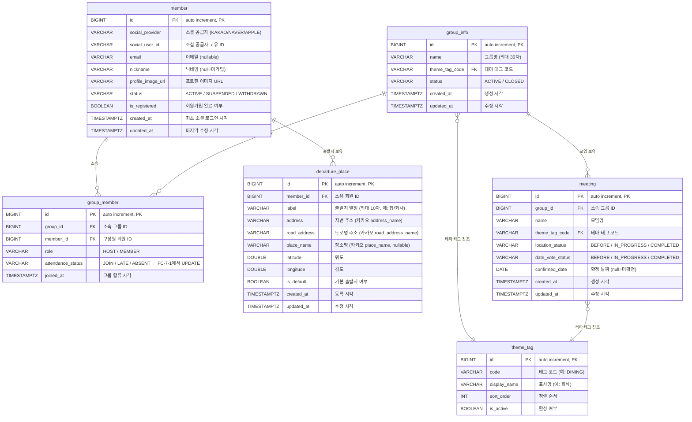

# ERD — FC-7-1 내 정보 수정

FC-7-1은 신규 테이블 없음. 기존 `group_member`(참석여부 UPDATE), `departure_place`(INSERT/UPDATE) 사용.

```mermaid
erDiagram
    %% [기존] member — 회원
    member {
        BIGINT id PK "auto increment, PK"
        VARCHAR social_provider "소셜 공급자 (KAKAO/NAVER/APPLE)"
        VARCHAR social_user_id "소셜 공급자 고유 ID"
        VARCHAR email "이메일 (nullable)"
        VARCHAR nickname "닉네임 (null=미가입)"
        VARCHAR profile_image_url "프로필 이미지 URL"
        VARCHAR status "ACTIVE / SUSPENDED / WITHDRAWN"
        BOOLEAN is_registered "회원가입 완료 여부"
        TIMESTAMPTZ created_at "최초 소셜 로그인 시각"
        TIMESTAMPTZ updated_at "마지막 수정 시각"
    }

    %% [기존] group_info — 그룹
    group_info {
        BIGINT id PK "auto increment, PK"
        VARCHAR name "그룹명 (최대 30자)"
        VARCHAR theme_tag_code FK "테마 태그 코드"
        VARCHAR status "ACTIVE / CLOSED"
        TIMESTAMPTZ created_at "생성 시각"
        TIMESTAMPTZ updated_at "수정 시각"
    }

    %% [기존, FC-7-1 수정 대상] group_member — 그룹 구성원 (attendance_status UPDATE)
    group_member {
        BIGINT id PK "auto increment, PK"
        BIGINT group_id FK "소속 그룹 ID"
        BIGINT member_id FK "구성원 회원 ID"
        VARCHAR role "HOST / MEMBER"
        VARCHAR attendance_status "JOIN / LATE / ABSENT ← FC-7-1에서 UPDATE"
        TIMESTAMPTZ joined_at "그룹 합류 시각"
    }

    %% [기존, FC-7-1 수정 대상] departure_place — 출발지 (INSERT/UPDATE)
    departure_place {
        BIGINT id PK "auto increment, PK"
        BIGINT member_id FK "소유 회원 ID"
        VARCHAR label "출발지 별칭 (최대 10자, 예: 집/회사)"
        VARCHAR address "지번 주소 (카카오 address_name)"
        VARCHAR road_address "도로명 주소 (카카오 road_address_name)"
        VARCHAR place_name "장소명 (카카오 place_name, nullable)"
        DOUBLE latitude "위도"
        DOUBLE longitude "경도"
        BOOLEAN is_default "기본 출발지 여부"
        TIMESTAMPTZ created_at "등록 시각"
        TIMESTAMPTZ updated_at "수정 시각"
    }

    %% [기존] meeting — 모임
    meeting {
        BIGINT id PK "auto increment, PK"
        BIGINT group_id FK "소속 그룹 ID"
        VARCHAR name "모임명"
        VARCHAR theme_tag_code FK "테마 태그 코드"
        VARCHAR location_status "BEFORE / IN_PROGRESS / COMPLETED"
        VARCHAR date_vote_status "BEFORE / IN_PROGRESS / COMPLETED"
        DATE confirmed_date "확정 날짜 (null=미확정)"
        TIMESTAMPTZ created_at "생성 시각"
        TIMESTAMPTZ updated_at "수정 시각"
    }

    %% [기존] theme_tag — 테마 태그
    theme_tag {
        BIGINT id PK "auto increment, PK"
        VARCHAR code "태그 코드 (예: DINING)"
        VARCHAR display_name "표시명 (예: 회식)"
        INT sort_order "정렬 순서"
        BOOLEAN is_active "활성 여부"
    }

    member ||--o{ group_member : "소속"
    group_info ||--o{ group_member : "구성원 보유"
    group_info ||--o{ meeting : "모임 보유"
    group_info }o--|| theme_tag : "테마 태그 참조"
    meeting }o--|| theme_tag : "테마 태그 참조"
    member ||--o{ departure_place : "출발지 보유"
```
