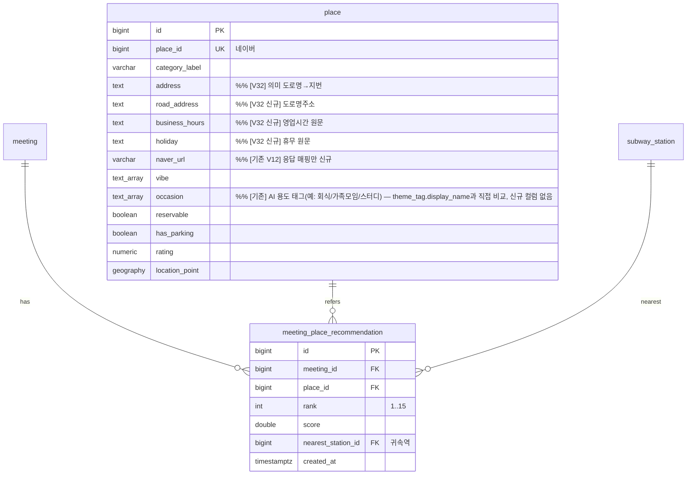

# ERD — FC-8 추천

- 추천 스코어링은 기존 `occasion`(TEXT[], V12) 그대로 사용 — 변경 없음
- **V32**: place 상세 바텀시트용 컬럼 추가 — `road_address`/`business_hours`/`holiday`(신규, nullable) + `address` 의미 도로명→지번. `naver_url`은 기존 컬럼(응답 매핑만 신규). 장소 상세 API(`GET /api/v1/places?ids=`)에서 사용
- V20: meeting_place_recommendation 신규
- (meeting + categories/vibes/reservable/parking 는 FC-4 erd 참조, V18)
