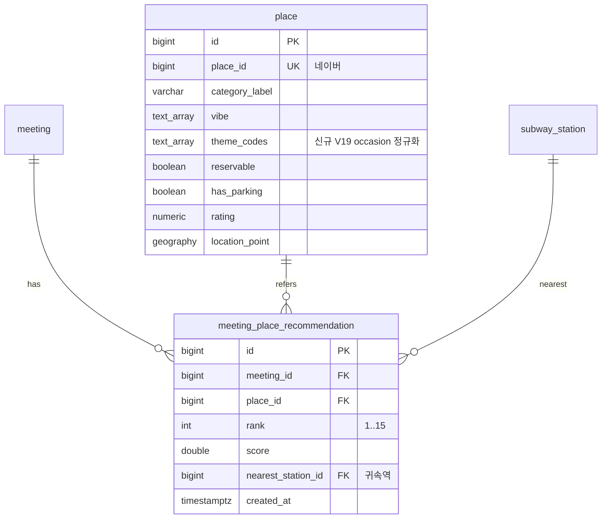

# ERD — FC-8 추천

```mermaid
erDiagram
    meeting ||--o{ meeting_place_recommendation : has
    place ||--o{ meeting_place_recommendation : refers
    subway_station ||--o{ meeting_place_recommendation : nearest

    place {
        bigint id PK
        bigint place_id UK "네이버"
        varchar category_label
        text_array vibe
        text_array theme_codes "신규 V19 occasion 정규화"
        boolean reservable
        boolean has_parking
        numeric rating
        geography location_point
    }
    meeting_place_recommendation {
        bigint id PK
        bigint meeting_id FK
        bigint place_id FK
        int rank "1..15"
        double score
        bigint nearest_station_id FK "귀속역"
        timestamptz created_at
    }
```
- V19: place + theme_codes TEXT[]
- V20: meeting_place_recommendation 신규
- (meeting + categories/vibes 는 FC-4 erd 참조, V18)
