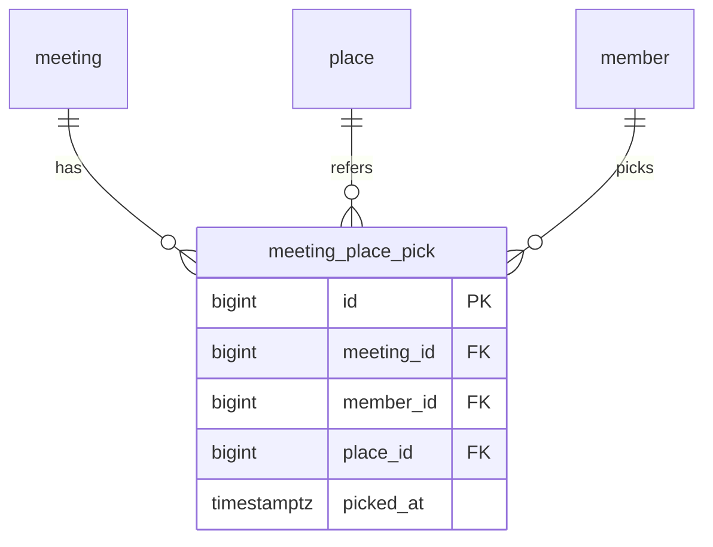

# ERD — FC-9 담기

```mermaid
erDiagram
    meeting ||--o{ meeting_place_pick : has
    place ||--o{ meeting_place_pick : refers
    member ||--o{ meeting_place_pick : picks

    meeting_place_pick {
        bigint id PK
        bigint meeting_id FK
        bigint member_id FK
        bigint place_id FK
        timestamptz picked_at
    }
```
- V21: meeting_place_pick (UNIQUE meeting_id, member_id, place_id)
- 담기완료 = 해당 member 의 pick count >= 1 (파생)
