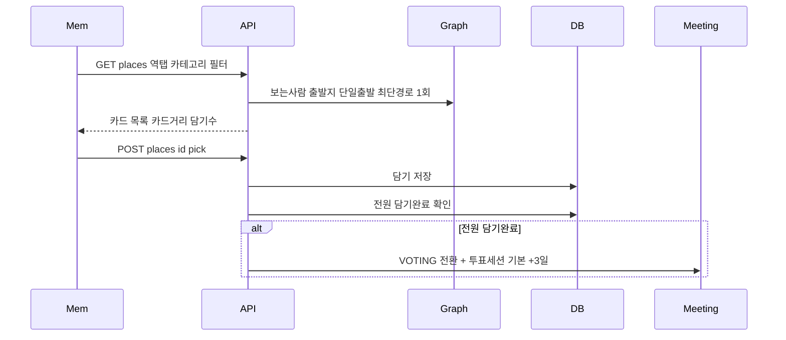

# 처리 흐름 — FC-9 담기

## 담기 → 전환
1. 담기/취소 토글 → 담기완료/미완료 갱신
2. 전환 트리거: 전원완료 / 마감배치(+3일) / 호스트 투표생성
3. 마감 0개 → 스코어 top3 자동등록 후 VOTING

## 상태 전이
- RECOMMENDED → VOTING

## 스케줄러
- 담기마감(+3일) 배치: 후보≥1 VOTING / 후보0 top3 후 VOTING
