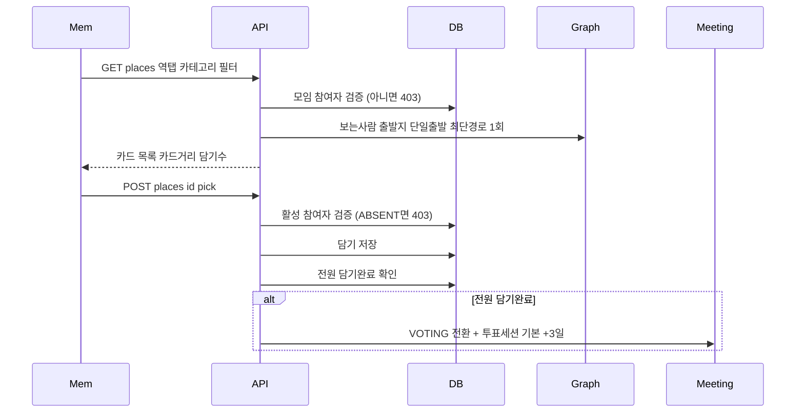

# 처리 흐름 — FC-9 담기

## 인가 검증 (담기·취소·조회 공통 선행)
1. `meeting_participant`(meetingId+memberId) 조회 — 없으면 403 MEETING_024 (그룹원이어도 이 모임 참여자가 아니면 거부)
2. 담기/취소(쓰기)는 추가로 `attendanceStatus != ABSENT` 확인 — 불참이면 403 MEETING_025

## 담기 → 전환
1. 담기/취소 토글 → 담기완료/미완료 갱신
2. 전환 트리거: 전원완료 / 마감배치(+3일) / 호스트 투표생성
3. 마감 0개 → 스코어 top3 자동등록 후 VOTING

> 완료 판정 분모 = 활성 참여자(ABSENT 제외). 참석여부는 장소 단계 진입 시 잠기므로(FC-7-1) 담기 도중 분모는 고정된다.

## 상태 전이
- RECOMMENDED → VOTING

## 스케줄러
- 담기마감(+3일) 배치: 후보≥1 VOTING / 후보0 top3 후 VOTING
