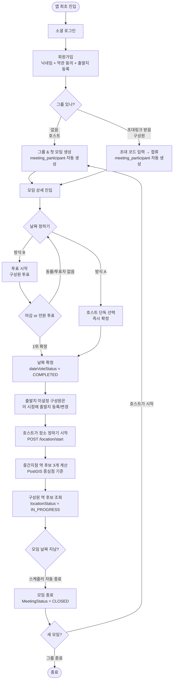
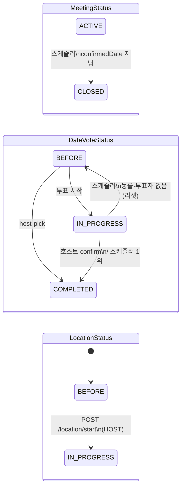

# Bangawo 전체 플로우 개요

---

## 사용자 여정

---

## 상태 전이

---

## FC별 기능 요약

| FC | 기능 | 주요 API | 관련 테이블 |
|---|---|---|---|
| FC-4 | 그룹 & 모임 생성 | `POST /groups/create` | group_info, meeting, group_member, meeting_participant |
| FC-5 | 초대 & 합류 | `POST /groups/{id}/invite` `POST /groups/join` | group_invite, group_member, meeting_participant |
| FC-6 | 모임 리스트 (홈) | `GET /meetings` | meeting, group_member, departure_place |
| FC-7 | 날짜 투표 | `POST /date-vote` `POST /date-vote/host-pick` `POST /date-vote/submit` `PATCH /date-vote/confirm` | date_vote_session, date_vote_option, date_vote_record |
| FC-7-1 | 내 정보 수정 | `PATCH /groups/{id}/members/me/attendance` `POST /departure-places` `PUT /departure-places/{id}` `PATCH /meetings/{id}/participants/me/departure` | group_member, departure_place, meeting_participant |
| FC-8 | 그룹 생명주기 | `PATCH /groups/{id}/close` `POST /groups/{id}/meetings` | group_info, meeting |
| FC-midpoint | 중간지점 역 추천 | `POST /meetings/{id}/location/start` `GET /meetings/{id}/midpoint-stations` | meeting_participant, subway_station, midpoint_station_candidate |

---

## 테이블 생성 시점

| 테이블 | 언제 레코드가 생기나 |
|---|---|
| `member` | 소셜 로그인 최초 진입 시 |
| `group_info` | 호스트가 그룹 생성 시 |
| `meeting` | 그룹 생성 시 (첫 모임) / 새 모임 생성 시 |
| `group_member` | 그룹 생성 시 (호스트) / 초대 합류 시 (구성원) |
| `group_invite` | 호스트가 초대 코드 발급 시 (기존 코드 삭제 후 재생성) |
| `meeting_participant` | 그룹 생성 시 (호스트) / 초대 합류 시 (구성원) |
| `departure_place` | 회원가입 시 / 출발지 추가 시 |
| `date_vote_session` | 호스트가 날짜 투표 시작 시 |
| `date_vote_option` | 날짜 투표 시작 시 (후보 날짜 수만큼) |
| `date_vote_record` | 구성원이 투표 시 |
| `midpoint_station_candidate` | `POST /location/start` 호출 시 |

---

## 권한 정리

| 액션 | HOST | MEMBER |
|---|---|---|
| 그룹 생성 | O | — |
| 초대 코드 발급 | O | X |
| 날짜 투표 시작 | O | X |
| 날짜 직접 확정 | O | X |
| 투표 참여 | O | O |
| 참석여부 변경 | O (본인) | O (본인) |
| 출발지 추가/수정 | O | O |
| 모임 출발지 변경 | O | O |
| 장소 선정 시작 | O | X |
| 역 후보 조회 | O | O |
| 그룹 종료 | O | X |
| 새 모임 생성 | O | X |
