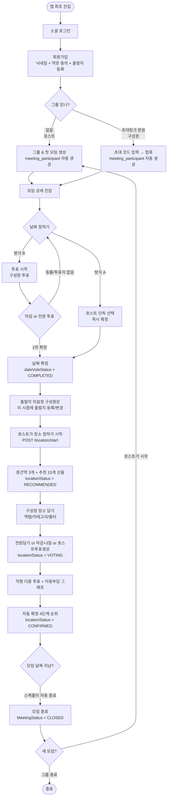
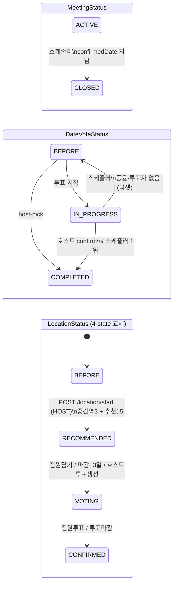

# Bangawo 전체 플로우 개요

---

## 사용자 여정

---

## 상태 전이

> 가드: 장소축 시작은 `dateVoteStatus == COMPLETED` AND `locationStatus == BEFORE` 일 때만.

---

## FC별 기능 요약

| FC | 기능 | 주요 API | 관련 테이블 |
|---|---|---|---|
| FC-4 | 그룹 & 모임 생성 | `POST /groups/create` | group_info, meeting, group_member, meeting_participant |
| FC-5 | 초대 & 합류 | `POST /groups/{id}/invite` `POST /groups/join` | group_invite, group_member, meeting_participant |
| FC-6 | 모임 리스트 (홈) | `GET /meetings` | meeting, group_member, departure_place |
| FC-7 | 날짜 투표 | `POST /date-vote` `POST /date-vote/host-pick` `POST /date-vote/submit` `PATCH /date-vote/confirm` | date_vote_session, date_vote_option, date_vote_record |
| FC-7-1 | 내 정보 수정 | `PATCH /meetings/{id}/participants/me/attendance` `POST /departure-places` `PUT /departure-places/{id}` `PATCH /meetings/{id}/participants/me/departure` | departure_place, meeting_participant ※ 참석여부는 group_member가 아닌 meeting_participant(미팅 단위)로 관리 |
| (그룹 생명주기) | 그룹 종료/새 모임 | `PATCH /groups/{id}/close` `GET /groups/{id}/members` `POST /groups/{id}/meetings`(참여자 명단 선택) | group_info, meeting, group_member, meeting_participant |
| FC-midpoint | 중간지점 역 추천 | `POST /meetings/{id}/location/start` `GET /meetings/{id}/midpoint-stations` | meeting_participant, subway_station, midpoint_station_candidate |
| **FC-8** | 중간역 반경 장소 추천 15 + 장소 상세 조회(상세필드 보강) | `POST /location/start`(확장) `GET /recommendations` `GET /places/options` `GET /places?ids=`(상세, V32 보강) `GET /places/nearby` | place(추천=기존 occasion 재사용 / **V32: road_address·business_hours·holiday 추가 + address 의미 지번 + naver_url 응답 매핑**), meeting_place_recommendation |
| **FC-9** | 후보 담기/취소 | `GET /places` `POST·DELETE /places/{id}/pick` `GET /places/pick-status` | meeting_place_pick |
| **FC-11** | 투표 세션·마감일 | `POST /place-vote` | meeting_place_vote_session |
| **FC-12** | 익명 다중 투표(후보=담긴장소, <3 추천백필) + 투표현황(득표·참여인원) + 참여팀원 + 친구들 거리보기(이동부담·경로) | `POST /place-vote/submit` `GET /place-vote` `GET /place-vote/participants` `GET /place-vote/{placeId}/travel-burden` | meeting_place_vote, meeting_travel_burden, subway_edge, meeting_place_pick(+source), meeting_participant(+출발지메타) |
| **FC-13** | 4단계 순위 자동확정 + 1~3위 + 수동확정 | `GET /place-result` `POST /place-confirm` | meeting_confirmed_place |

> ⭐ 2026-06-24 mvp3-1 갭 보완: FC-12 후보 = 담긴 장소(추천15 아님)·placeId 검증·정렬·호스트 완료현황 / FC-13 동점4=최초담은시각·1~3위·수동확정. 푸시·실시간·H3 제외. 상세: `docs/prd/mvp3-1-gap-analysis.md`.

> FC 폴더: `review/fc8`·`fc9`·`fc11`·`fc12`·`fc13` (PRD mvp3.md 번호). 기존 그룹 생명주기는 번호 충돌 회피로 `review/fc-group-lifecycle` 로 보관(과거 'FC-8' 라벨이었음).

---

## 테이블 생성 시점

| 테이블 | 언제 레코드가 생기나 |
|---|---|
| `member` | 소셜 로그인 최초 진입 시 |
| `group_info` | 호스트가 그룹 생성 시 |
| `meeting` | 그룹 생성 시 (첫 모임) / 새 모임 생성 시 |
| `group_member` | 그룹 생성 시 (호스트) / 초대 합류 시 (구성원) |
| `group_invite` | 호스트가 초대 코드 발급 시 (기존 코드 삭제 후 재생성) |
| `meeting_participant` | 그룹 생성 시 (호스트) / 초대 합류 시 (구성원) |
| `departure_place` | 회원가입 시 / 출발지 추가 시 |
| `date_vote_session` | 호스트가 날짜 투표 시작 시 |
| `date_vote_option` | 날짜 투표 시작 시 (후보 날짜 수만큼) |
| `date_vote_record` | 구성원이 투표 시 |
| `midpoint_station_candidate` | `POST /location/start` 호출 시 |
| `meeting_place_recommendation` | `POST /location/start` 추천 15 산출 시 |
| `meeting_place_pick` | 모임원이 장소 담기 시 |
| `meeting_place_vote_session` | 투표 생성/전환 시 |
| `meeting_place_vote` | 모임원이 장소 투표 시 |
| `meeting_travel_burden` | 투표 시작 시 1회 스냅샷 |
| `meeting_confirmed_place` | 장소 자동 확정 시 |

---

## 권한 정리

| 액션 | HOST | MEMBER |
|---|---|---|
| 그룹 생성 | O | — |
| 초대 코드 발급 | O | X |
| 날짜 투표 시작 | O | X |
| 날짜 직접 확정 | O | X |
| 투표 참여 | O | O |
| 참석여부 변경 (미팅별, meeting_participant) | O (본인) | O (본인) |
| 출발지 추가/수정 | O | O |
| 모임 출발지 변경 | O | O |
| 장소 선정 시작 | O | X |
| 역 후보 조회 | O | O |
| 장소 담기/취소 | O | O |
| 투표 생성하기 | O | X |
| 장소 투표 | O | O |
| 그룹 종료 | O | X |
| 새 모임 생성 | O | X |
