# 마스터 ERD — Bangawo 전체 테이블

> 기능이 추가될 때마다 이 파일을 업데이트합니다.

```mermaid
erDiagram
    %% [기존] member — 회원
    member {
        BIGINT id PK "회원 고유 ID"
        VARCHAR(20) social_provider "소셜 공급자 (KAKAO/NAVER/APPLE)"
        VARCHAR(255) social_user_id "공급자가 부여한 사용자 고유 ID"
        VARCHAR(255) email "이메일 (애플은 비공개 가능, nullable)"
        VARCHAR(20) nickname "닉네임 (null이면 회원가입 미완료)"
        VARCHAR(500) profile_image_url "프로필 이미지 URL"
        VARCHAR(20) status "회원 상태 (ACTIVE/SUSPENDED/WITHDRAWN)"
        BOOLEAN is_registered "회원가입 완료 여부"
        TIMESTAMPTZ created_at "최초 소셜 로그인 시각"
        TIMESTAMPTZ updated_at "마지막 정보 수정 시각"
        TIMESTAMPTZ deleted_at "탈퇴 시각 (null이면 활동 중)"
    }

    %% [기존] refresh_token — JWT 리프레시 토큰
    refresh_token {
        BIGINT id PK "토큰 고유 ID"
        BIGINT member_id FK "토큰 소유 회원 ID"
        VARCHAR(255) token_hash "토큰 SHA-256 해시 (원문 저장 안 함)"
        TIMESTAMPTZ expires_at "토큰 만료 시각"
        TIMESTAMPTZ revoked_at "토큰 폐기 시각 (null이면 유효)"
        TIMESTAMPTZ created_at "토큰 발급 시각"
    }

    %% [기존 + V10 확장] departure_place — 출발지
    departure_place {
        BIGINT id PK "출발지 고유 ID"
        BIGINT member_id FK "소유 회원 ID"
        VARCHAR(10) label "출발지 별칭 (예: 집, 회사)"
        VARCHAR(255) address "지번 주소 (카카오 address_name)"
        VARCHAR(255) road_address "도로명 주소 (카카오 road_address_name, V10 추가)"
        VARCHAR(100) place_name "장소명 (카카오 place_name, V10 추가, nullable)"
        DOUBLE latitude "위도"
        DOUBLE longitude "경도"
        BOOLEAN is_default "기본 출발지 여부"
        TIMESTAMPTZ created_at "등록 시각"
        TIMESTAMPTZ updated_at "수정 시각"
    }

    %% [기존] terms — 약관
    terms {
        BIGINT id PK "약관 고유 ID"
        VARCHAR(30) type "약관 유형 (TERMS_OF_SERVICE/PRIVACY_POLICY/MARKETING)"
        VARCHAR(20) version "약관 버전 (예: 1.0)"
        VARCHAR(200) title "약관 제목"
        TEXT content "약관 본문"
        BOOLEAN is_required "필수 동의 여부"
        TIMESTAMPTZ effective_from "약관 시행일"
        TIMESTAMPTZ created_at "등록 시각"
    }

    %% [기존] terms_agreement — 약관 동의 이력
    terms_agreement {
        BIGINT id PK "동의 이력 고유 ID"
        BIGINT member_id FK "동의한 회원 ID"
        BIGINT terms_id FK "동의한 약관 ID"
        TIMESTAMPTZ agreed_at "동의 시각"
    }

    %% [기존] device_token — 푸시 알림 디바이스 토큰
    device_token {
        BIGINT id PK "토큰 고유 ID"
        BIGINT member_id FK "소유 회원 ID"
        VARCHAR(500) token "APNs 디바이스 토큰"
        VARCHAR(10) platform "플랫폼 (IOS)"
        VARCHAR(20) app_version "앱 버전"
        TIMESTAMPTZ created_at "등록 시각"
        TIMESTAMPTZ updated_at "갱신 시각"
    }

    %% [FC-4] theme_tag — 테마 태그
    theme_tag {
        BIGINT id PK "태그 고유 ID"
        VARCHAR(30) code "태그 코드 UNIQUE (예: BUSINESS)"
        VARCHAR(50) display_name "화면 표시 이름 (예: 비즈니스)"
        INT sort_order "정렬 순서"
        BOOLEAN is_active "활성 여부 (false면 신규 선택 불가)"
    }

    %% [FC-4] group_info — 그룹
    group_info {
        BIGINT id PK "그룹 고유 ID"
        VARCHAR(30) name "그룹명 (모임명과 동일한 값)"
        VARCHAR(30) theme_tag_code "테마 태그 코드 (theme_tag.code 참조)"
        VARCHAR(10) status "그룹 상태 (ACTIVE/CLOSED)"
        TIMESTAMPTZ created_at "생성 시각"
        TIMESTAMPTZ updated_at "수정 시각"
    }

    %% [FC-4 + V9 + V18 확장] meeting — 모임
    meeting {
        BIGINT id PK "모임 고유 ID"
        BIGINT group_id FK "소속 그룹 ID"
        VARCHAR(30) name "모임명"
        VARCHAR(30) theme_tag_code "테마 태그 코드"
        VARCHAR(10) status "모임 진행 상태 (ACTIVE/CLOSED) — V9"
        VARCHAR(15) location_status "장소 선정 상태 (BEFORE/RECOMMENDED/VOTING/CONFIRMED) — V18 코멘트 기준"
        VARCHAR(15) date_vote_status "날짜 투표 상태 (BEFORE/IN_PROGRESS/COMPLETED)"
        DATE confirmed_date "확정된 모임 날짜 (미확정 시 null)"
        TEXT_ARRAY category_labels "FC-8 추천 음식 카테고리 선호 (선택) — V18"
        TEXT_ARRAY vibes "FC-8 추천 분위기 선호 (선택) — V18"
        BOOLEAN reservable "FC-8 HARD 필터 예약가능, NULL=조건없음 — V18"
        BOOLEAN parking "FC-8 HARD 필터 주차가능, NULL=조건없음 — V18"
        TIMESTAMPTZ created_at "생성 시각"
        TIMESTAMPTZ updated_at "수정 시각"
    }

    %% [FC-4] group_member — 그룹 구성원
    group_member {
        BIGINT id PK "구성원 고유 ID"
        BIGINT group_id FK "소속 그룹 ID"
        BIGINT member_id FK "구성원 회원 ID"
        VARCHAR(10) role "역할 (HOST/MEMBER)"
        VARCHAR(10) attendance_status "참석여부 (JOIN/LATE/ABSENT)"
        TIMESTAMPTZ joined_at "그룹 합류 시각"
    }

    %% [FC-7] date_vote_session — 투표 세션
    date_vote_session {
        BIGINT id PK "투표 세션 고유 ID"
        BIGINT meeting_id FK "소속 모임 ID (UNIQUE)"
        VARCHAR(10) method "투표 방식 (HOST_PICK/VOTE)"
        DATE deadline "투표 마감일 (VOTE 방식만, nullable)"
        INT duration_days "투표 기간 일수 (1/3/7)"
        VARCHAR(10) status "세션 상태 (ACTIVE/EXPIRED/CONFIRMED)"
        TIMESTAMPTZ created_at "세션 생성 시각"
    }

    %% [FC-7] date_vote_option — 투표 후보 날짜
    date_vote_option {
        BIGINT id PK "후보 날짜 고유 ID"
        BIGINT session_id FK "소속 투표 세션 ID"
        DATE candidate_date "후보 날짜"
        INT sort_order "정렬 순서 (0부터)"
    }

    %% [FC-7] date_vote_record — 투표 기록
    date_vote_record {
        BIGINT id PK "투표 기록 고유 ID"
        BIGINT option_id FK "투표한 후보 날짜 ID"
        BIGINT member_id FK "투표한 회원 ID"
        TIMESTAMPTZ voted_at "투표 시각"
    }

    %% [FC-5] group_invite — 그룹 초대 코드
    group_invite {
        BIGINT id PK "고유 ID"
        BIGINT group_id FK "대상 그룹 ID"
        VARCHAR(36) code "UUID 초대 코드 (UNIQUE)"
        TIMESTAMPTZ expires_at "만료 시각 (발급 후 48시간)"
        TIMESTAMPTZ created_at "발급 시각"
    }

    %% [MVP2] meeting_participant — 모임별 참여자 출발지
    meeting_participant {
        BIGINT id PK "고유 ID"
        BIGINT meeting_id FK "소속 모임 ID"
        BIGINT member_id FK "참여자 회원 ID"
        DOUBLE latitude "출발지 위도 (nullable — 출발지 미등록 시 null)"
        DOUBLE longitude "출발지 경도 (nullable — 출발지 미등록 시 null)"
        VARCHAR(10) attendance_status "참석 상태 (JOIN/LATE/ABSENT)"
    }

    %% [MVP2] subway_station — 지하철역 마스터
    subway_station {
        BIGINT station_id PK "공공데이터 역사 ID"
        VARCHAR(100) station_name "역명 (예: 홍대입구)"
        VARCHAR(100) line_name "노선명 (예: 2호선)"
        DOUBLE latitude "위도"
        DOUBLE longitude "경도"
        GEOGRAPHY location_point "PostGIS geography(Point,4326)"
    }

    %% [MVP2] midpoint_station_candidate — 중간지점 역 후보
    midpoint_station_candidate {
        BIGINT id PK "고유 ID"
        BIGINT meeting_id FK "소속 모임 ID"
        INT rank "후보 순위 (1=가장 가까운 역)"
        VARCHAR(100) station_name "역명"
        VARCHAR(200) lines "노선 목록 (예: 2호선, 6호선)"
        NUMERIC distance_km "중심점까지 거리 (km)"
    }

    member ||--o{ refresh_token : "1회원 N토큰"
    member ||--o{ departure_place : "1회원 N출발지"
    member ||--o{ terms_agreement : "1회원 N약관동의"
    member ||--o{ device_token : "1회원 N디바이스토큰"
    member ||--o{ date_vote_record : "1회원 N투표기록"
    member ||--o{ group_member : "1회원 N그룹참여"
    member ||--o{ meeting_participant : "1회원 N모임참여"
    group_info ||--o{ group_invite : "1그룹 N초대코드"
    %% [V12] place — 장소 마스터 (네이버 place_id 기준)
    place {
        BIGINT id PK "장소 고유 ID"
        BIGINT place_id UK "네이버 place_id (NOT NULL UNIQUE)"
        VARCHAR(100) name "상호명"
        VARCHAR(50) branch "지점명 (nullable)"
        VARCHAR(100) category "네이버 원본 카테고리"
        VARCHAR(20) category_label "한식/일식/중식/양식/카페/디저트/주점/분식/아시아음식/기타"
        TEXT address "주소"
        DOUBLE latitude "위도"
        DOUBLE longitude "경도"
        GEOGRAPHY location_point "PostGIS geography(Point,4326)"
        BOOLEAN has_room "룸 보유 (NULL=정보없음)"
        BOOLEAN has_group_seat "단체석 보유"
        BOOLEAN has_parking "주차 가능"
        BOOLEAN reservable "예약 가능"
        INT max_group_size "최대 단체 인원"
        TEXT_ARRAY vibe "AI 분위기 태그 배열 (예: 감성적,차분한)"
        TEXT_ARRAY occasion "AI 용도 태그 배열 — theme_tag.display_name과 직접 비교"
        VARCHAR(2) size_fit "소/중/대"
        TEXT summary "AI 요약"
        VARCHAR(200) naver_url "네이버 URL"
        NUMERIC rating "평점 NUMERIC(3,2)"
        INT review_count "리뷰 수"
        TIMESTAMPTZ created_at "등록 시각"
        TIMESTAMPTZ updated_at "수정 시각"
    }
    %% [V20] meeting_place_recommendation — 추천 15 스냅샷
    meeting_place_recommendation {
        BIGINT id PK
        BIGINT meeting_id FK
        BIGINT place_id FK
        INT rank "1..15"
        DOUBLE score
        BIGINT nearest_station_id FK "귀속역"
        TIMESTAMPTZ created_at
    }
    %% [장소선정 신규] meeting_place_pick — 담기
    meeting_place_pick {
        BIGINT id PK
        BIGINT meeting_id FK
        BIGINT member_id FK
        BIGINT place_id FK
        TIMESTAMPTZ picked_at
    }
    %% [장소선정 신규] meeting_place_vote_session — 투표 세션
    meeting_place_vote_session {
        BIGINT id PK
        BIGINT meeting_id FK,UK
        TIMESTAMPTZ started_at
        TIMESTAMPTZ deadline
        VARCHAR status "IN_PROGRESS/CLOSED"
    }
    %% [장소선정 신규] meeting_place_vote — 투표(익명집계)
    meeting_place_vote {
        BIGINT id PK
        BIGINT session_id FK
        BIGINT member_id FK
        BIGINT place_id FK
        TIMESTAMPTZ voted_at
    }
    %% [장소선정 신규] meeting_travel_burden — 이동부담 스냅샷
    meeting_travel_burden {
        BIGINT id PK
        BIGINT meeting_id FK
        BIGINT member_id FK
        BIGINT place_id FK
        INT seconds "소요초"
        INT transfers "환승수"
    }
    %% [장소선정 신규] meeting_confirmed_place — 확정 장소
    meeting_confirmed_place {
        BIGINT id PK
        BIGINT meeting_id FK,UK
        BIGINT place_id FK
        VARCHAR place_name
        TEXT address
        TIMESTAMPTZ confirmed_at
    }
    %% [기존] subway_edge — 이동 그래프(V17)
    subway_edge {
        BIGINT id PK
        BIGINT from_station_id FK
        BIGINT to_station_id FK
        INT weight_sec
        VARCHAR edge_type "RIDE/TRANSFER"
    }

    terms ||--o{ terms_agreement : "1약관 N동의이력"
    theme_tag ||--o{ group_info : "1태그 N그룹"
    theme_tag ||--o{ meeting : "1태그 N모임"
    group_info ||--o{ meeting : "1그룹 N모임"
    group_info ||--o{ group_member : "1그룹 N구성원"
    meeting ||--o| date_vote_session : "1모임 0~1세션"
    meeting ||--o{ meeting_participant : "1모임 N참여자스냅샷"
    meeting ||--o{ midpoint_station_candidate : "1모임 N역후보"
    date_vote_session ||--o{ date_vote_option : "1세션 N후보"
    date_vote_option ||--o{ date_vote_record : "1후보 N투표기록"
    meeting ||--o{ meeting_place_recommendation : "1모임 N추천"
    place ||--o{ meeting_place_recommendation : "1장소 N추천"
    meeting ||--o{ meeting_place_pick : "1모임 N담기"
    place ||--o{ meeting_place_pick : "1장소 N담기"
    meeting ||--|| meeting_place_vote_session : "1모임 1세션"
    meeting_place_vote_session ||--o{ meeting_place_vote : "1세션 N투표"
    place ||--o{ meeting_place_vote : "1장소 N투표"
    meeting ||--o{ meeting_travel_burden : "1모임 N이동부담"
    place ||--o{ meeting_travel_burden : "1장소 N이동부담"
    meeting ||--|| meeting_confirmed_place : "1모임 1확정"
    subway_station ||--o{ subway_edge : "역 그래프 엣지"
```

## 테이블 목록

| 테이블 | 마이그레이션 | 설명 |
|---|---|---|
| `member` | V2 | 회원 |
| `refresh_token` | V2 | JWT 리프레시 토큰 |
| `departure_place` | V3 + V10 | 출발지 (V10: road_address, place_name 추가) |
| `terms` | V4 | 약관 |
| `terms_agreement` | V4 | 약관 동의 이력 |
| `device_token` | V5 | 푸시 알림 디바이스 토큰 |
| `theme_tag` | V7 (FC-4) | 테마 태그 |
| `group_info` | V7 (FC-4) | 그룹 |
| `meeting` | V7 (FC-4) + V9 | 모임 (V9: status 컬럼 추가) |
| `group_member` | V7 (FC-4) | 그룹 구성원 |
| `date_vote_session` | V8 (FC-7) | 날짜 투표 세션 |
| `date_vote_option` | V8 (FC-7) | 투표 후보 날짜 |
| `date_vote_record` | V8 (FC-7) | 투표 기록 |
| `meeting_participant` | V11 + V15 (MVP2) | 모임별 참여자 출발지 (합류 시 생성, V15에서 lat/lng nullable) |
| `place` | V12 (MVP2) | 장소 마스터 (네이버 place_id, PostGIS) |
| `midpoint_station_candidate` | V13 (MVP2) | 중간지점 역 후보 (rank 1~3) |
| `group_invite` | V14 (FC-5) | 그룹 초대 코드 (48시간 만료) |
| `subway_station` | V16 (MVP2) | 지하철역 마스터 (PostGIS) |
| `subway_edge` | V17 (MVP2) | 지하철 이동 그래프 (RIDE/TRANSFER, weight_sec) |
| `meeting` (확장) | **V18** | + category_labels[], vibes[], reservable, parking (장소추천 옵션) |
| `meeting_place_recommendation` | **V20** | 추천 15 스냅샷 (rank/score/귀속역) — place 테이블 변경 없음(기존 occasion 재사용) |
| `meeting_place_pick` | **V21** | 장소 담기 (모임원×장소) |
| `meeting_place_vote_session` | **V22** | 장소 투표 세션 (마감일) |
| `meeting_place_vote` | **V23** | 장소 투표 (익명 집계) |
| `meeting_travel_burden` | **V24** | 이동부담 스냅샷 (소요초/환승수) |
| `meeting_confirmed_place` | **V25** | 확정 장소 고정 저장 |
| `meeting` locationStatus | **V26** | 4-state 데이터 마이그레이션 |
