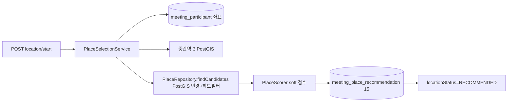
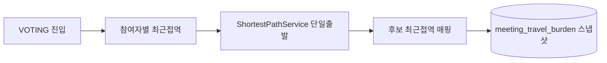

# Component Dependency — FC-8~13

## 의존 매트릭스
| From \ To | place | subway | meeting.domain | member | group | global |
|---|---|---|---|---|---|---|
| PlaceSelectionService | ✔ port | ✔(midpoint) | ✔ | ✔(출발지) | ✔(권한) | ✔ |
| PlacePickService | ✔ | ✔(최단경로) | ✔ | ✔ | ✔ | ✔ |
| PlaceVoteService | ✔ | ✔(최단경로) | ✔ | ✔ | - | ✔ |
| PlaceConfirmService | - | - | ✔ | - | - | ✔ |
| Scheduler | - | ✔ | ✔ | ✔ | - | ✔ |

- 모든 컨텍스트 간 호출은 **도메인 포트(interface)** 경유. JPA 직접 의존 금지(DDD 규약).

## 통신 패턴
- 동기 호출(단일 모놀리식). 이벤트버스 미사용(범위 외).
- subway 그래프는 **싱글턴 빈**(부팅 1회 로드, 읽기 공유).
- 상태전이 트리거(전원 담기/투표 완료)는 서비스 내 후처리 호출(동일 트랜잭션).

## 데이터 흐름 (FC-8 추천)

## 데이터 흐름 (FC-12 이동부담)

## 빌드/패키지 순서 (의존 기반)
1. global(ErrorCode) → 2. meeting.domain(LocationStatus/Meeting 가드) →
3. subway(그래프) ∥ place(추천) → 4. meeting 서비스(담기/투표/확정) → 5. 스케줄러
