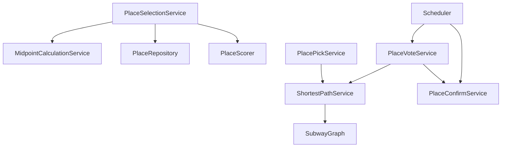

# Services & Orchestration — FC-8~13

## PlaceSelectionService (FC-8)
오케스트레이션:
1. 모임/호스트 검증 + `Meeting.startLocationPhase()`(가드: dateVoteStatus==COMPLETED)
2. ATTEND/LATE 참여자 출발지 스냅샷 검증
3. `MidpointCalculationService.calculate` → 중간역 3개(반경 2→4→6 사다리)
4. `PlaceRepository.findCandidates(역3, 반경, 예약/주차)` → 후보(거리·최근접역 포함)
5. `PlaceScorer.score(...)` → 상위 15 + 귀속역
6. `MeetingPlaceRecommendation` 저장, `locationStatus→RECOMMENDED`
- 0개(6km) → `PLACE_RECOMMENDATION_EMPTY`

## PlacePickService (FC-9)
- `getPlaces`: 추천 스냅샷 + 역탭/카테고리/필터 + 보는사람 카드거리(`ShortestPathService.shortestFrom(내출발역)`)
- `togglePick`: 담기/취소. 담기수 0→1 = 담기완료, 1→0 = 미완료
  - 후처리: 전원 담기완료면 `toVoting()` 전환 트리거(→ PlaceVoteService.openSession 기본 +3일)
- `startVoteByHost`: 후보≥1 시 즉시 VOTING 전환

## PlaceVoteService (FC-11/12)
- `openSession`(내부): VoteSession 생성(마감 프리셋/기본+3일, 검증: 시작<마감<약속일)
  - **이동부담 스냅샷 생성**: 참여자별 `ShortestPathService.shortestFrom(출발역)` 1회 → 각 후보 최근접역 조회 → `MeetingTravelBurden` 저장
- `submitVote`: 다중제한(후보수 50% 내림, 최소1) 검증, 익명 저장. 0개되면 미완료
  - 후처리: 전원 투표완료면 `PlaceConfirmService.confirm` 트리거
- `getVoteStatus`: 익명 집계(득표수) + 후보별 이동부담(시간/환승) + 최장이동자 식별

## PlaceConfirmService (FC-13)
- `confirm`: 4단계 순위(득표→시간합→환승합→등록순) → 1위 `MeetingConfirmedPlace` 저장, `locationStatus→CONFIRMED`
- 전원 기권 → 4순위(등록순)

## PlaceSelectionScheduler (기존 MeetingScheduler 패턴, @cron 매일 0시 KST)
- `processPickDeadlines`: 담기마감(+3일) 도래 → 후보≥1 VOTING / 후보0 top3 자동등록 후 VOTING
- `processVoteDeadlines`: 투표마감 도래 → `confirm`

## 서비스 상호작용

## 트랜잭션 경계
- 각 application 서비스 메서드 = 트랜잭션 단위
- 그래프 로딩/다익스트라는 읽기 전용(메모리), 스냅샷 저장만 쓰기
- 상태전이 + 스냅샷 저장은 동일 트랜잭션
