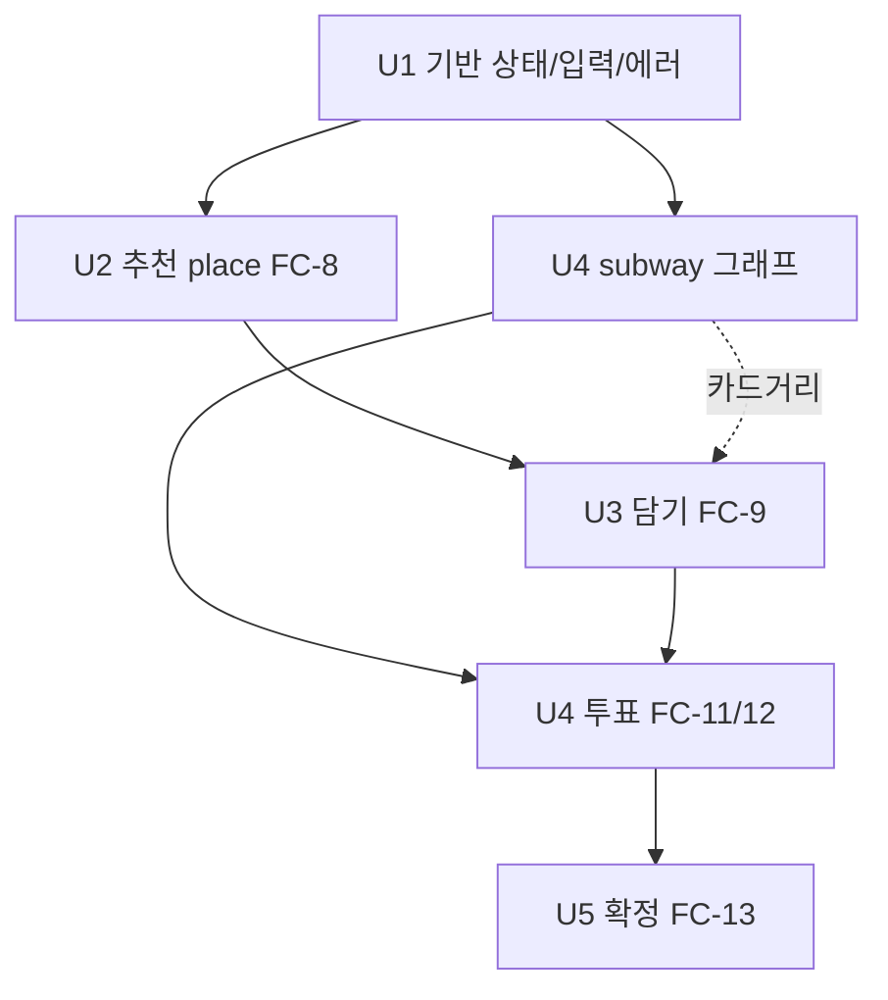

# Unit of Work Dependency — FC-8~13

## 의존 그래프

## 의존 매트릭스
| Unit | 의존(선행) | 병렬 가능 | 변경 유형 |
|---|---|---|---|
| U1 기반 | - | - | Major(상태 enum 교체) |
| U2 추천 | U1 | U4-그래프 | Major(place 신규) |
| U3 담기 | U2 (카드거리 U4) | - | Major |
| U4 투표 | U3, U4-그래프 | 그래프는 U2와 병렬 | Major |
| U5 확정 | U4 | - | Minor |

## 권장 순서
1. **U1** (선행 필수)
2. **U2** ∥ **U4-그래프(SubwayGraph)** (병렬)
3. **U3** (U4 그래프 준비되면 카드거리 통합)
4. **U4-투표**
5. **U5**

## 조정 포인트
- 카드거리(U3)는 U4 그래프 의존 → U4 그래프를 U3 전에 끝내거나, U3는 직선거리 임시 후 U4에서 교체
- locationStatus enum 교체(U1)는 기존 컴파일 영향 → 최우선
- 마감 스케줄러는 기존 MeetingScheduler에 메서드 추가(충돌 주의)

## 테스트 체크포인트
- U1: 상태전이/가드 단위테스트
- U2: 스코어러 PBT(정규화·가중합)
- U4: 다익스트라 정확성(소요초/환승) 단위테스트
- 통합: BEFORE→RECOMMENDED→VOTING→CONFIRMED 시나리오
