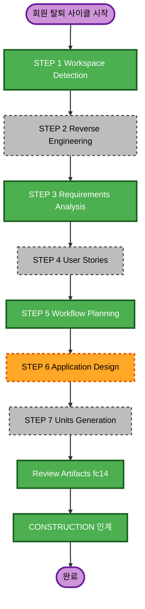

# 실행 계획 — 회원 탈퇴 기능

- 작성일: 2026-08-24
- 입력: `requirements-member-withdrawal.md` (R1~R10)

---

## 1. 영향 범위 분석

### 1-1. 변경 대상 컨텍스트

| 컨텍스트 | 변경 유형 | 내용 |
|---|---|---|
| `member` | **Major** | 탈퇴 유스케이스 신규 (오케스트레이션 주체) |
| `auth` | Minor | `Member` 도메인에 익명화 메서드 추가, refresh_token 삭제, Apple revoke 클라이언트 신규 |
| `group` | Minor | 호스트 자동 승계 (`GroupMember` 역할 이전, `Group` CLOSED 전이) |
| `meeting` | Minor | 참여자 출발지 스냅샷 NULL 처리, travel_burden 삭제, `getVoteParticipants` 가드 1줄 |
| `storage` | Minor | 프로필 이미지 객체 삭제 |
| `global` | Minor | `JwtAuthenticationFilter` 상태 검증, `ErrorCode` 추가 |

### 1-2. 변경 영향 평가

| 영역 | 영향 | 비고 |
|---|---|---|
| 사용자 노출 | 있음 | 신규 API 1개, 탈퇴 회원 표시 변경 |
| 구조 변경 | 없음 | 기존 레이어 구조 유지 |
| 데이터 모델 | **없음** | Flyway 마이그레이션 불필요 (기존 컬럼 활용) |
| API 계약 | 있음 | 신규 엔드포인트, 인증 필터 동작 변경(전역) |
| NFR | 있음 | 인증 요청당 회원 조회 1회 추가, 개인정보 파기 |

### 1-3. 리스크 평가: **Medium**

| 리스크 | 내용 | 완화 |
|---|---|---|
| 파기 누락 | 10개 참조 테이블 중 하나라도 빠지면 방침 위반 | 요구사항 R3/R4 파기 매트릭스를 리뷰 아티팩트(`rules.md`)에 명문화, 테스트로 검증 |
| 전역 필터 변경 | `JwtAuthenticationFilter` 는 모든 인증 요청 경유 | 회원 조회 실패 시 기존 동작 유지, 단위 테스트 필수 |
| 되돌릴 수 없음 | 파기는 롤백 불가 | 트랜잭션 경계 명확화, 외부 호출(스토리지/Apple)은 트랜잭션 밖 best-effort |
| 외부 의존 | Apple revoke 자격증명·iOS 앱 작업 미완 | 미설정 시 skip 설계로 개발 차단 없음 |

---

## 2. 단계별 실행 결정

| 단계 | 결정 | 근거 |
|---|---|---|
| STEP 2 Reverse Engineering | **SKIP** | RE 아티팩트 현행 유지, auth/member/group/meeting 직접 검토 완료 |
| STEP 4 User Stories | **SKIP** | 백엔드 API 1개, 역할 단순(본인), PRD 수준 행위 명세 불필요 |
| STEP 6 Application Design | **EXECUTE** | 신규 유스케이스 + 크로스 컨텍스트 오케스트레이션 + 신규 외부 클라이언트(Apple) → 컴포넌트 경계 정의 필요 |
| STEP 7 Units Generation | **SKIP** | 단일 단위. 순차 구현 가능하며 유닛 분할 이득 없음 |
| Review Artifacts | **EXECUTE** | 기존 FC 폴더 컨벤션 준수 (신규 FC 폴더 1개 + overview 갱신) |
| NFR | **EXECUTE (경량)** | Security Baseline 적용, 성능은 기존 설정 충분 |

---

## 3. 구현 순서 (CONSTRUCTION 참고용)

의존 관계상 아래 순서를 권장한다.

```
1. ErrorCode 추가 + Member 도메인 익명화 메서드
2. 각 Repository에 삭제/조회 메서드 추가 (auth·member·meeting·group)
3. Apple revoke 클라이언트 (설정 미주입 시 skip)
4. 탈퇴 오케스트레이션 서비스 + Controller
5. JwtAuthenticationFilter 상태 검증 (R9)
6. getVoteParticipants 가드 보완 (R8)
7. 단위 테스트 + 전체 빌드
```

- 1~2는 병렬 가능, 3은 독립적으로 선행 가능
- 5는 전역 영향이므로 4 완료 후 단독 커밋 권장
- 6은 독립 (언제든 가능)

---

## 4. 산출물 계획

| 단계 | 산출물 |
|---|---|
| Application Design | `application-design-member-withdrawal.md` |
| Review Artifacts | `construction/review/fc14/{rules,api,erd,flow}.md` + `overview.md` 갱신 |
| ERD | `project-erd.md` — 스키마 변경 없으므로 **파기 정책 주석만 추가** |

---

## 5. 워크플로우 시각화

### Mermaid



### 텍스트 대안

```
INCEPTION
  STEP 1 Workspace Detection ... 완료
  STEP 2 Reverse Engineering ... SKIP
  STEP 3 Requirements Analysis .. 완료 (승인대기)
  STEP 4 User Stories ........... SKIP
  STEP 5 Workflow Planning ...... 완료
  STEP 6 Application Design ..... EXECUTE
  STEP 7 Units Generation ....... SKIP
  Review Artifacts (fc14) ....... EXECUTE
CONSTRUCTION
  별도 세션(@construction)으로 인계
```
