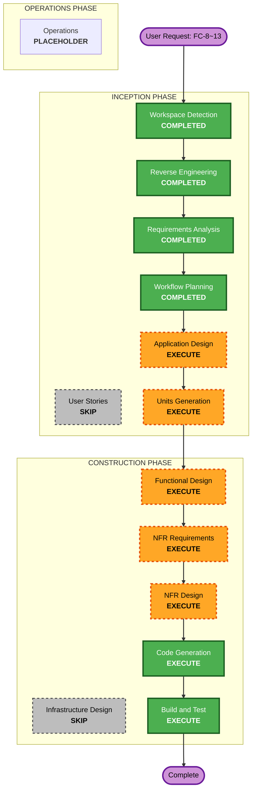

# Execution Plan — 장소 선정~확정 (FC-8~13)

## Detailed Analysis Summary

### Transformation Scope (Brownfield)
- **Transformation Type**: Application change (인프라/배포모델 변경 없음 — 기존 Cloud Run 유지)
- **Primary Changes**:
  - `meeting` 컨텍스트 확장 (locationStatus 4-state, 담기/투표/확정 도메인·서비스·API)
  - `place` 신규 도메인 (테이블 V12만 존재 → 도메인/리포/추천 신규)
  - `subway` 확장 (subway_edge 그래프 로딩 + 다익스트라 최단경로 컴포넌트)
- **Related Components**: group(권한/참석), member(출발지), global(ErrorCode 추가), 스케줄러(기존 MeetingScheduler 패턴)

### Change Impact Assessment
- **User-facing changes**: Yes — 신규 장소선정/담기/투표/확정 API
- **Structural changes**: No — DDD 레이어/패키지 구조 유지, 컨텍스트 내 확장
- **Data model changes**: Yes — 신규 테이블 5종(추천스냅샷/담기/투표/이동부담스냅샷/확정결과) + locationStatus enum
- **API changes**: Yes — FC-8~13 신규 엔드포인트, 기존 location/start 확장
- **NFR impact**: Yes — PostGIS 추천 성능, 그래프 다익스트라 성능, Security, Cloud Run 다중인스턴스 스냅샷

### Component Relationships
- **Primary**: meeting (확장), place (신규), subway (확장)
- **Shared**: global(Coordinate, ErrorCode), member(DeparturePlace), group(GroupMember/Role)
- **Dependent**: 스케줄러(담기/투표 마감 배치)
- **변경 유형**: meeting=Major / place=Major(신규) / subway=Minor(엣지 추가) / global=Patch(에러코드)

### Risk Assessment
- **Risk Level**: Medium — 신규 알고리즘(추천 스코어링, 그래프 최단경로) + 상태머신 확장
- **Rollback Complexity**: Moderate — 신규 테이블/엔드포인트 위주라 기존 기능 영향 적음(단 locationStatus enum 교체는 주의)
- **Testing Complexity**: Moderate — 추천/최단경로/순위 로직 단위테스트 필요

## Workflow Visualization

### Text Alternative
- INCEPTION: WD(완료) → RE(완료) → RA(완료) → US(SKIP) → WP(완료) → AD(실행) → UG(실행)
- CONSTRUCTION: FD(실행) → NFRA(실행) → NFRD(실행) → ID(SKIP) → CG(실행) → BT(실행)
- OPERATIONS: PLACEHOLDER

## Phases to Execute

### INCEPTION PHASE
- [x] Workspace Detection (COMPLETED)
- [x] Reverse Engineering (COMPLETED)
- [x] Requirements Analysis (COMPLETED)
- [x] User Stories (SKIPPED) — 백엔드 API, 역할 2개(호스트/모임원) 단순, PRD가 행위 상세 명세
- [x] Workflow Planning (IN PROGRESS)
- [ ] Application Design — **EXECUTE**
  - Rationale: place 신규 컨텍스트 + subway 그래프 컴포넌트 + meeting 확장, 컴포넌트/메서드/의존성 정의 필요
- [ ] Units Generation — **EXECUTE**
  - Rationale: FC-8/9/11-12/13이 데이터·상태별로 분리되는 다중 유닛

### CONSTRUCTION PHASE
- [ ] Functional Design — **EXECUTE**
  - Rationale: 추천 스코어링·최단경로·4단계 순위 등 복잡 비즈니스 로직
- [ ] NFR Requirements — **EXECUTE**
  - Rationale: Security(ON), PostGIS/그래프 성능, Cloud Run 다중인스턴스 스냅샷
- [ ] NFR Design — **EXECUTE (경량)**
  - Rationale: 부팅 시 그래프 로딩 전략, 인덱스, 스냅샷 동시성
- [ ] Infrastructure Design — **SKIP**
  - Rationale: 인프라/배포모델 변경 없음(기존 Cloud Run + Cloud SQL 재사용)
- [ ] Code Generation — EXECUTE (ALWAYS)
- [ ] Build and Test — EXECUTE (ALWAYS)

### OPERATIONS PHASE
- [ ] Operations — PLACEHOLDER

## Package Change Sequence (Brownfield)
1. **global** — ErrorCode 신규(FC-9/11/12/13) [Patch, 선행]
2. **meeting/domain** — locationStatus 4-state 교체 + 가드 [Major, 선행 — 다른 유닛이 의존]
3. **subway** — subway_edge 로딩 + 최단경로 컴포넌트 [Minor, FC-12 전 필요]
4. **place** — 도메인/리포/추천 스코어링 [Major, FC-8 핵심]
5. **meeting** — 담기/투표/확정 서비스·API·스케줄러 [Major, 위 의존]

업데이트 전략: **Sequential** (상태/도메인 선행 → 추천 → 담기·투표·확정). place·subway는 일부 병렬 가능.

## Estimated Timeline
- **Total Execute Stages**: 11 (Inception 2 + Construction 6 + 기완료 3)
- **Estimated Duration**: Construction 다회 세션 (유닛별)

## Success Criteria
- **Primary Goal**: 호스트 장소정하기 → 담기 → 투표 → 자동확정 백엔드 동작
- **Key Deliverables**: 신규 테이블 5종 + place/subway 컴포넌트 + meeting 확장 + 스케줄러
- **Quality Gates**: compileJava 성공, 핵심 로직(추천/최단경로/순위) 단위테스트, Security 베이스라인
- **Integration Testing**: 상태 전이 BEFORE→RECOMMENDED→VOTING→CONFIRMED 통합 시나리오
- **Operational Readiness**: 기존 Cloud Run 배포 파이프라인 재사용
