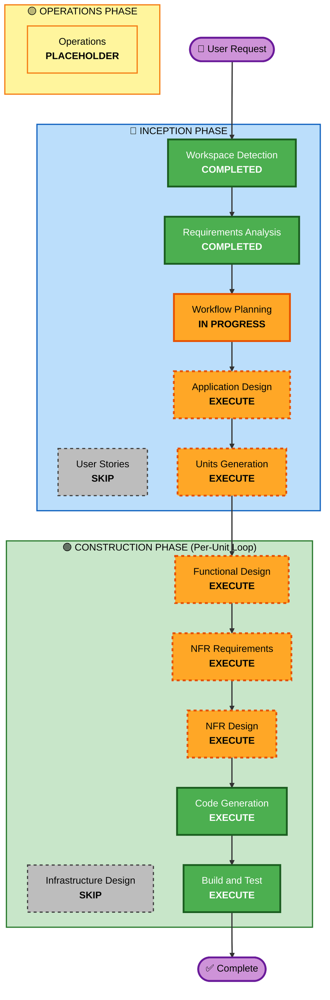

# Execution Plan

> **생성일**: 2026-04-25  
> **프로젝트**: 반가워(Bangawo) 서버 MVP 1차

---

## Detailed Analysis Summary

### Change Impact Assessment

| 영향 영역 | 해당 | 설명 |
|---|---|---|
| User-facing changes | ✅ | 소셜 로그인, 회원가입, 출발지 관리, 약관 동의 — iOS 앱 사용자 대면 API |
| Structural changes | ✅ | 5개 바운디드 컨텍스트 기반 DDD 아키텍처 신규 구축 |
| Data model changes | ✅ | 6개 테이블 신규 (member, refresh_token, departure_place, terms, terms_agreement, device_token) |
| API changes | ✅ | REST API 전체 신규 설계 (`/api/v1/**`) |
| NFR impact | ✅ | Security Baseline 15개 규칙, JWT 인증, PostGIS, Docker Compose |

### Risk Assessment

| 항목 | 평가 |
|---|---|
| Risk Level | **Medium** — Greenfield이므로 기존 시스템 영향 없음, 5개 컨텍스트 + DDD 완전 분리 + 소셜 3사 연동은 중간 복잡도 |
| Rollback Complexity | **Easy** — 신규 프로젝트, 롤백 불필요 |
| Testing Complexity | **Moderate** — 소셜 로그인 외부 연동 Mock, PostGIS Testcontainers |

---

## Workflow Visualization



### Text Alternative

```
Phase 1: INCEPTION
  - Workspace Detection      (COMPLETED)
  - Requirements Analysis     (COMPLETED)
  - User Stories              (SKIP)
  - Workflow Planning         (IN PROGRESS)
  - Application Design        (EXECUTE)
  - Units Generation          (EXECUTE)

Phase 2: CONSTRUCTION (Per-Unit Loop)
  - Functional Design         (EXECUTE)
  - NFR Requirements          (EXECUTE)
  - NFR Design                (EXECUTE)
  - Infrastructure Design     (SKIP)
  - Code Generation           (EXECUTE)
  - Build and Test            (EXECUTE)

Phase 3: OPERATIONS
  - Operations                (PLACEHOLDER)
```

---

## Phases to Execute

### 🔵 INCEPTION PHASE
- [x] Workspace Detection (COMPLETED)
- [x] Requirements Analysis (COMPLETED) — Standard depth, 13 decisions
- [x] User Stories — SKIPPED (MVP 단순 구조, 사용자 별도 요청 없음)
- [x] Workflow Planning (IN PROGRESS)
- [ ] Application Design — **EXECUTE**
  - **Rationale**: 5개 바운디드 컨텍스트의 컴포넌트 구조, 메서드, 비즈니스 규칙 정의 필요. DDD 완전 분리 모델(Domain + JPA Entity + DTO + Mapper) 설계.
- [ ] Units Generation — **EXECUTE**
  - **Rationale**: 5개 컨텍스트를 구현 가능한 단위로 분해. 의존성 순서 결정 (Shared Kernel → Identity → Member → Terms → Notification).

### 🟢 CONSTRUCTION PHASE (Per-Unit Loop)
- [ ] Functional Design — **EXECUTE**
  - **Rationale**: 6개 테이블 데이터 모델, 소셜 로그인 검증 로직, 약관 재동의 플로우, 금칙어 필터 등 복잡한 비즈니스 로직 상세 설계 필요.
- [ ] NFR Requirements — **EXECUTE**
  - **Rationale**: Security Baseline 15개 규칙 적용, JWT 보안 정책, 입력 검증 전략, Rate Limiting 등 NFR 요구사항 정의.
- [ ] NFR Design — **EXECUTE**
  - **Rationale**: NFR Requirements에서 정의된 보안/성능 패턴을 구체적 설계로 반영.
- [ ] Infrastructure Design — **SKIP**
  - **Rationale**: MVP 단계에서 Docker Compose 로컬 개발만. 클라우드 인프라(Oracle Cloud) 미확정. 배포 시점에 별도 진행.
- [ ] Code Generation — **EXECUTE** (항상)
  - **Rationale**: 구현 필수. Planning + Generation 2단계.
- [ ] Build and Test — **EXECUTE** (항상)
  - **Rationale**: 빌드 지침, 단위/통합 테스트 지침 생성.

### 🟡 OPERATIONS PHASE
- [ ] Operations — **PLACEHOLDER**
  - **Rationale**: 향후 배포/모니터링 워크플로우 확장 예정.

---

## Execution Summary

| 항목 | 값 |
|---|---|
| 총 단계 | 12 |
| 실행 단계 | 8 (Application Design, Units Generation, Functional Design, NFR Requirements, NFR Design, Code Generation, Build and Test + Workflow Planning) |
| 스킵 단계 | 3 (User Stories, Infrastructure Design, Operations) |
| 완료 단계 | 2 (Workspace Detection, Requirements Analysis) |

## Success Criteria

- **Primary Goal**: Bangawo 서버 MVP 1차 — 소셜 로그인, 회원가입, 출발지 관리, 약관 관리, 디바이스 토큰 저장 API 완성
- **Key Deliverables**:
  - Spring Boot 3.x 기반 REST API 서버
  - PostgreSQL + PostGIS 데이터베이스 스키마 (Flyway 마이그레이션)
  - Docker Compose 로컬 개발 환경
  - JUnit 5 + Testcontainers 테스트
  - Swagger UI API 문서
- **Quality Gates**:
  - Security Baseline SECURITY-01~15 준수
  - 모든 단위 테스트 통과
  - 빌드 성공
