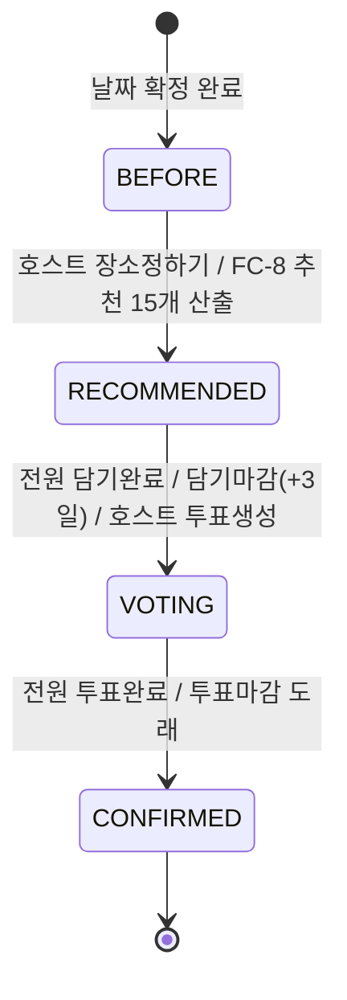
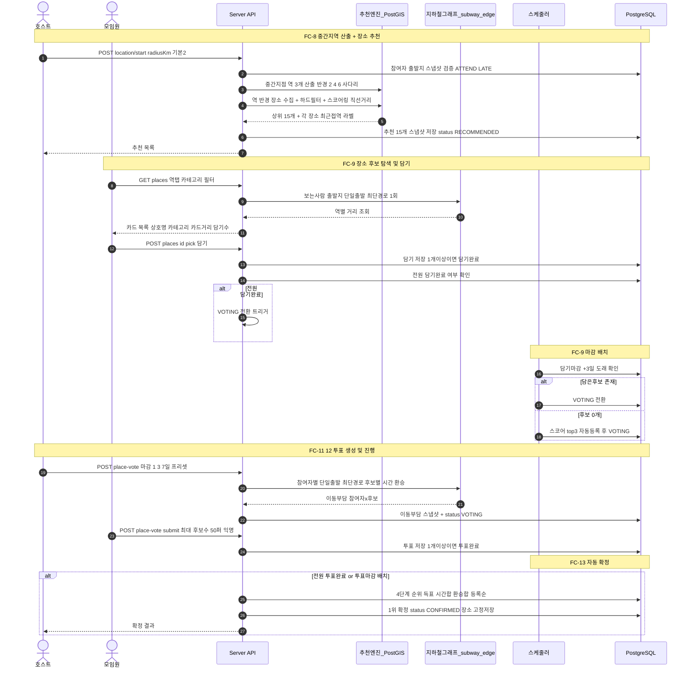

# 장소 선정~확정 전체 플로우 정리 (FC-8~13)

> 본 문서는 PRD(docs/prd/mvp3.md) + Round1/2 답변을 반영한 **흐름 파악용** 정리.
> 미확정(R5 저장방식, R1-2 역탭)은 가정 표기. 최종 수치/스키마는 Application Design에서 확정.

---

## 1. 상태 모델 (확정)

`LocationStatus` enum 교체: `BEFORE → RECOMMENDED → VOTING → CONFIRMED`

상태 전이 트리거 요약
| From | To | 트리거 |
|---|---|---|
| BEFORE | RECOMMENDED | 호스트 `location/start` → 중간역3 + 추천15 산출 |
| RECOMMENDED | VOTING | (a)전원 담기완료 (b)담기마감 +3일 배치 (c)호스트 투표생성 |
| VOTING | CONFIRMED | (a)전원 투표완료 (b)투표마감 배치 |

---

## 2. 전체 시퀀스 다이어그램

---

## 3. 단계별 상세

### FC-8 중간지역 산출 + 장소 추천
- 권한: 호스트만. `locationStatus=BEFORE` 에서만.
- 참여자 스냅샷: ATTEND/LATE 구성원 출발지 좌표 고정(meeting_participant).
- 중간역 3개: 참여자 좌표 centroid → PostGIS 근접 역 rank1~3 (반경 2→4→6km 사다리).
- 장소 수집: 3개 역 반경 N km(기본2, 부족 시 4·6 확대) 내 place + 하드필터(예약/주차 등 요청 옵션).
- 스코어링: `score = w1·(1 - 거리정규) + w2·(태그·옵션 매칭) + w3·(rating정규)` (집단 직선거리 기준, min-max 정규화, 가중치 설계단계 확정) → 상위 15.
- 역 귀속: 각 장소를 3개 역 중 최근접역에 라벨(역 탭 필터용 / R1-2 미확정).
- 결과: 추천 15개 스냅샷 저장, status RECOMMENDED.
- 에러: 비호스트 403 / 이미시작 400 / 출발지 미등록 400 / 6km까지 역·장소 0개 400.

### FC-9 장소 후보 리스트 + 담기
- 조회: 역 탭(역별 장소) · 카테고리 · 필터(예약/주차, 이동해도 유지) · 스코어 내림차순.
- 카드: 상호명, 카테고리, 도로명주소, 분위기태그≤3, **카드거리(보는사람 출발지 기준 그래프 이동값)**, 함께담기 수, [+].
- 담기 정의: 1개 이상 담으면 그 모임원 "담기완료"(프로필 체크). 0개 되면 미완료 복귀.
- VOTING 전환: (a)전원 담기완료 (b)담기마감 +3일 배치 (c)호스트 투표생성(후보≥1).
- 마감 0개: 스코어 top3 자동 후보등록 후 VOTING.

### FC-11 투표 생성 + 마감일
- 마감 프리셋: 시작+1/+3/+7일, 23:59:59. 자동전환 시 기본 +3일.
- 검증: 마감일 < 약속일, 마감일 > 시작일. 위반 시 안내.

### FC-12 투표 진행
- 정렬: 투표전 가나다 / 투표후 득표순 실시간.
- 다중제한: 1인 최대 = 후보수 50% 내림(최소1).
- 완료 정의: 1개 이상 투표 시 완료. 0개 되면 미완료.
- 익명: member_id 저장하되 집계·완료여부만 노출(호스트도 누가→어디 불가).
- 이동부담: subway_edge 그래프 최단경로(참여자별 단일출발 다익스트라) → 후보별 소요시간·환승수. 투표 시작 시 1회 산출(저장방식 R5 미확정).

### FC-13 자동 확정
- 순위: 1)득표최다 2)이동시간합 최소 3)환승합 최소 4)등록순 빠름.
- 전원 기권: 전원 0표 동점 → 4순위(등록순).
- 확정: status CONFIRMED, 확정 장소 고정 저장.

---

## 4. 확정/가정 메모
- 확정: 4-state, 마감+3일, 환승=TRANSFER엣지, 추천0개 반경확대(최대6km), 투표 PRD규칙, 익명저장.
- 거리 분리: 추천=직선거리집계 / 카드·이동부담=그래프 다익스트라.
- 푸시알림 전체 범위 제외.
- 미확정(R5 이동부담 저장방식 / R1-2 역탭 유지) → 답변 후 requirements.md 확정.
- 확장: Security ON, PBT Partial, TDD OFF.
