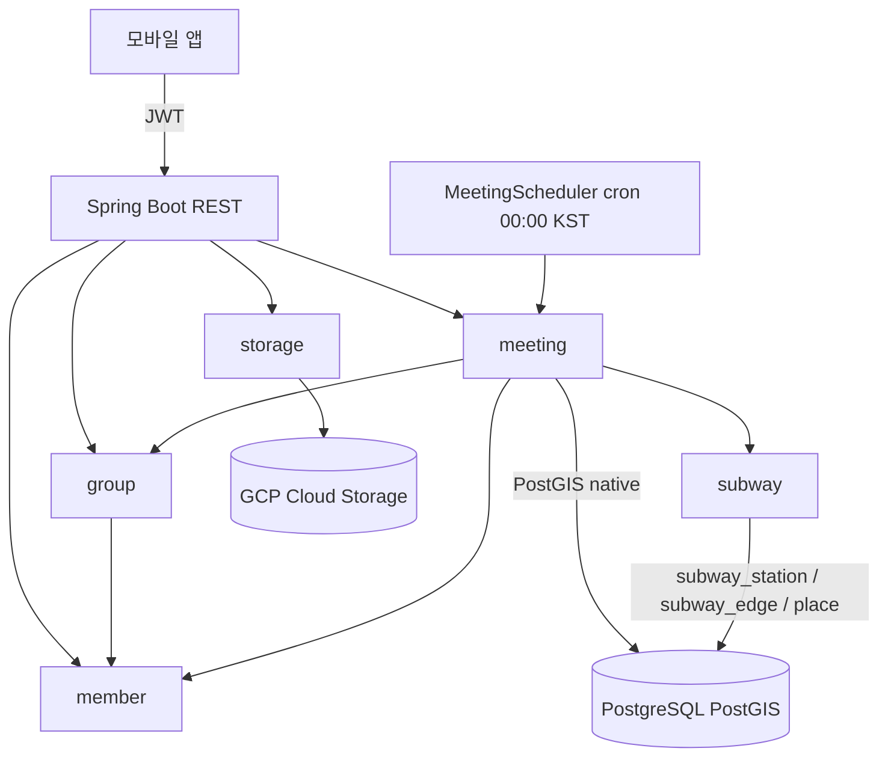
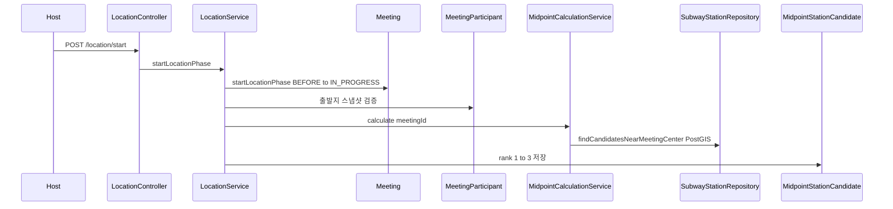

# System Architecture (RE refresh — FC-8~13 관점, 2026-06-16)

## System Overview
Bangawo(반가워)는 모임 일정·장소 조율 백엔드. Spring Boot 3.4.4 / Java 17 / DDD / PostgreSQL(PostGIS) + JPA + Flyway. GCP Cloud Run + Cloud SQL 운영.
이번 RE는 신규 피처 **장소 선정~확정(FC-8~13)** 구현 가능성 판단을 위해 subway/place/meeting 영역을 갱신 분석한다.

## Architecture Diagram


## Bounded Contexts (현행)
| Context | Purpose | FC-8~13 관련성 |
|---|---|---|
| auth | 소셜 로그인, JWT 발급 | 간접 |
| member | 회원, 출발지(departure_place), 약관 | 출발지 좌표 = 중간지점 입력 |
| group | 그룹, 멤버, 역할(HOST), 참석상태, 테마태그 | 호스트 권한·참여자 판정 |
| meeting | 모임, 날짜투표, 장소선정(LocationService/Midpoint), 스케줄러 | 핵심 — 확장 대상 |
| subway | 지하철역 마스터, 중간지점 후보 PostGIS 쿼리 | 핵심 — subway_edge 그래프 신규 활용 |
| storage | GCS Signed URL | 무관 |
| global | 보안/예외/공통(Coordinate) | 공통 |

## Layer Dependency (불변)
```
presentation -> application -> domain <- infrastructure
```

## FC-8~13 Gap 분석
**이미 구현된 선행 자산**
- `meeting_participant`(V11): 참여자 출발지 스냅샷 — 좌표 update API 존재
- `subway_station`(V16) + PostGIS GIST 인덱스, `findCandidatesNearMeetingCenter` native 쿼리
- `midpoint_station_candidate`(V13): 중간지점 역 rank 1~3 저장/조회 API 존재
- `place`(V12): 장소 마스터(네이버 place_id, vibe/occasion 배열, 좌표, 옵션 플래그) — **도메인 코드 없음**
- **`subway_edge`(V17)**: 이동 그래프(RIDE/TRANSFER, weight_sec) — 사용자가 직접 추가, **도메인 코드 없음**
- 스케줄러 인프라(`MeetingScheduler` @cron 매일 0시 KST), 날짜투표 마감 처리 패턴 존재

**미구현 (이번 피처 범위)**
- FC-8 장소 추천 15개 스코어링 + 역 귀속 태깅 (place 도메인 자체가 없음)
- FC-9 장소 담기(후보 담기/취소) + 담기 완료 정의/마감 전환
- FC-11 투표 생성·마감일 프리셋
- FC-12 장소 투표(익명 다중) + subway_edge 기반 이동부담(최단경로/환승) 계산·스냅샷
- FC-13 자동 확정(4단계 순위) + 확정 결과 저장
- 알림(Push/In-App) 트리거 — device_token(V5) 존재하나 발송 로직 미확인
- **상태 모델 불일치**: 현 `LocationStatus = BEFORE/IN_PROGRESS/COMPLETED` ↔ PRD = `BEFORE/RECOMMENDED/VOTING/CONFIRMED` → RA에서 확정 필요

## Data Flow (FC-8 startLocationPhase 현행)

→ FC-8 확장 시 이 흐름 뒤에 place 추천 15개 + 역 귀속 + 상태 RECOMMENDED 전이가 추가되어야 함.

## Integration Points
- **DB**: PostgreSQL 15 + PostGIS (geography Point 4326, GIST/GIN 인덱스)
- **GCS**: 이미지 Signed URL
- **소셜 로그인**: auth 컨텍스트
- **Push**: device_token 테이블 존재 (FC-8~13 알림 발송 구현 필요)

## Infrastructure
- GCP Cloud Run (자동배포: main 머지 → GitHub Actions)
- Cloud SQL PostgreSQL 15
- 스케줄러: 앱 내장 @Scheduled (별도 워커 없음)
