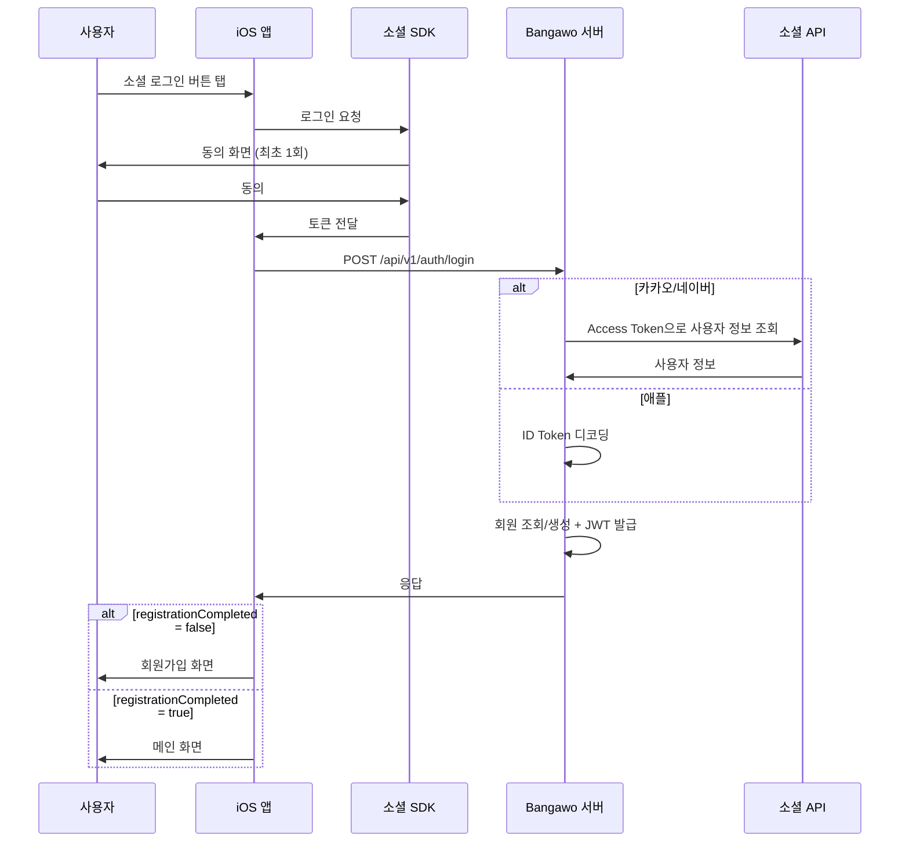
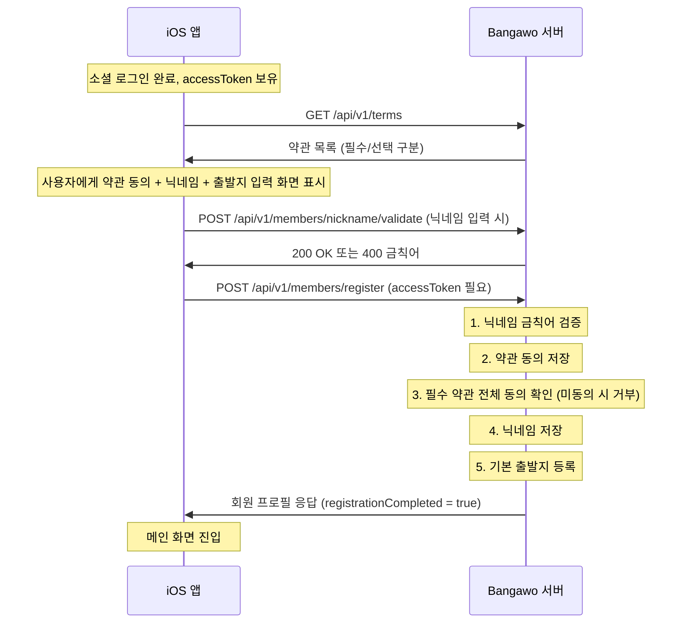

# 소셜 로그인 가이드

iOS 개발자를 위한 소셜 로그인 연동 가이드입니다.

---

## 전체 플로우



---

## 서버 API

### 로그인 요청

```
POST /api/v1/auth/login
Content-Type: application/json

{
    "provider": "KAKAO",        // "KAKAO" | "NAVER" | "APPLE"
    "providerToken": "토큰값"
}
```

- 카카오: `providerToken`에 **Access Token** 전달
- 네이버: `providerToken`에 **Access Token** 전달
- 애플: `providerToken`에 **ID Token** 전달

### 로그인 응답

```json
{
    "accessToken": "eyJ...",
    "refreshToken": "eyJ...",
    "firstSocialLogin": true,
    "registrationCompleted": false
}
```

| 필드 | 설명 |
|---|---|
| `accessToken` | API 호출용 JWT (1시간) |
| `refreshToken` | 토큰 갱신용 JWT (30일) |
| `firstSocialLogin` | 이번 요청에서 회원이 새로 생성됐는지 (첫 소셜 로그인) |
| `registrationCompleted` | 회원가입 완료 여부 (닉네임 설정 완료 = true) |

### iOS 분기 로직

- `registrationCompleted = false` → 회원가입 화면 (약관 동의 + 닉네임 + 출발지)
- `registrationCompleted = true` → 메인 화면

### 토큰 갱신

```
POST /api/v1/auth/refresh
Content-Type: application/json

{
    "refreshToken": "eyJ..."
}
```

응답은 로그인과 동일한 형태.

### 로그아웃

```
POST /api/v1/auth/logout
Authorization: Bearer {accessToken}
```

### 인증 헤더

로그인 이후 모든 API 호출 시:
```
Authorization: Bearer {accessToken}
```

---

## 회원가입 완료 플로우

소셜 로그인 성공 후 `registrationCompleted = false`이면 아직 정식 회원이 아닙니다.
아래 과정을 거쳐야 회원가입이 완료됩니다.

### 전체 흐름



### Step 1: 약관 목록 조회

```
GET /api/v1/terms
```

토큰 불필요 (공개 API).

**응답 (200)**
```json
[
    {
        "id": 1,
        "type": "TERMS_OF_SERVICE",
        "title": "이용약관",
        "content": "약관 본문...",
        "required": true
    },
    {
        "id": 2,
        "type": "PRIVACY_POLICY",
        "title": "개인정보처리방침",
        "content": "방침 본문...",
        "required": true
    },
    {
        "id": 3,
        "type": "MARKETING",
        "title": "마케팅 수신 동의",
        "content": "마케팅 본문...",
        "required": false
    }
]
```

`required = true`인 약관은 반드시 동의해야 회원가입 가능.

### Step 2: 닉네임 금칙어 검증

닉네임 입력 화면에서 호출. 통과해야 다음 단계로 진행.

```
POST /api/v1/members/nickname/validate
Authorization: Bearer {accessToken}
Content-Type: application/json

{
    "nickname": "홍길동"
}
```

**성공 (200)**: 빈 바디 — 사용 가능한 닉네임
**실패 (400)**: `{ "code": "MEMBER_002", "message": "사용할 수 없는 닉네임입니다" }`
우선은 ㅅㅂ 만 넣어 놨음

### Step 3: 회원가입 요청

```
POST /api/v1/members/register
Authorization: Bearer {accessToken}
Content-Type: application/json

{
    "nickname": "홍길동",
    "agreedTermsIds": [1, 2, 3],
    "departureLabel": "집",
    "departureAddress": "서울 강남구 삼성동 159",
    "departureRoadAddress": "서울 강남구 영동대로 513",
    "departurePlaceName": "카카오프렌즈 코엑스점",
    "departureIsDefault": true,
    "latitude": 37.4979,
    "longitude": 127.0276
}
```

> `departureAddress`: 카카오 API `address_name` (지번 주소)
> `departureRoadAddress`: 카카오 API `road_address_name` (도로명 주소)
> `departurePlaceName`: 카카오 API `place_name` (장소명, 없으면 null)
> `departureIsDefault`: 첫 등록은 항상 서버가 강제 true로 설정

| 필드 | 필수 | 설명 |
|---|---|---|
| `nickname` | ✅ | 2~20자, 금칙어 불가, 중복 허용 |
| `agreedTermsIds` | ✅ | 동의한 약관 ID 목록 (필수 약관 미포함 시 거부) |
| `departureLabel` | ✅ | 출발지 라벨 ("집", "회사" 등, 최대 10자) |
| `departureAddress` | ✅ | 지번 주소 (카카오 `address_name`) |
| `departureRoadAddress` | ✅ | 도로명 주소 (카카오 `road_address_name`) |
| `departurePlaceName` | ❌ | 장소명 (카카오 `place_name`, nullable) |
| `departureIsDefault` | ❌ | 기본 출발지 여부 (첫 등록 시 서버가 항상 true 강제) |
| `latitude` | ✅ | 위도 (카카오 `y`) |
| `longitude` | ✅ | 경도 (카카오 `x`) |

**성공 응답 (200)**
```json
{
    "id": 1,
    "nickname": "홍길동",
    "profileImageUrl": null,
    "socialProvider": "KAKAO",
    "registrationCompleted": true
}
```

**에러 응답**

| 코드 | 상황 |
|---|---|
| `MEMBER_002` | 닉네임 금칙어 포함 |
| `TERMS_001` | 필수 약관 미동의 |
| `COMMON_001` | 이미 가입 완료된 회원이 다시 호출 |

### 서버 내부 처리 순서

1. **닉네임 금칙어 검증** — 정적 리스트 + 정규식 + 자모 우회 대응
2. **약관 동의 저장** — `terms_agreement` 테이블에 INSERT (이미 동의한 건 스킵)
3. **필수 약관 전체 동의 확인** — 미동의 시 `TERMS_001` 에러로 거부
4. **기본 출발지 등록** — `departure_place` 테이블에 INSERT (`is_default = true`)
5. **닉네임 저장 + 회원가입 완료** — `member.nickname` 업데이트 + `member.is_registered = true`

모든 과정은 하나의 트랜잭션으로 처리됩니다. 중간에 실패하면 전체 롤백.

> `registrationCompleted`는 DB의 `member.is_registered` 컬럼으로 판단합니다.

---

## 공급자별 연동 가이드

### 카카오

#### 사전 설정 (카카오 디벨로퍼스)

1. https://developers.kakao.com 접속 → 앱 선택
2. **[카카오 로그인] > [사용 설정]** → 상태를 **ON**으로 변경
3. **[앱] > [플랫폼 키] > [REST API 키]** 클릭 → **호출 허용 API 주소**에 서버 IP 주소 입력 (필수!)
   - 로컬 테스트: 본인 공인 IP
   - 운영: 서버 공인 IP

#### iOS 연동

1. 카카오 iOS SDK 설치 ([가이드](https://developers.kakao.com/docs/latest/ko/kakaologin/ios))
2. SDK로 로그인 → **Access Token** 획득
3. 서버에 요청:
```json
{
    "provider": "KAKAO",
    "providerToken": "카카오_Access_Token"
}
```

---

### 애플

#### 사전 설정

- iOS 프로젝트의 Xcode에서 **Sign in with Apple** capability 활성화
- Apple Developer 계정에서 App ID에 Sign in with Apple 활성화
- **서버에 별도 키 설정 불필요** (iOS SDK 방식이라 서버는 ID Token 디코딩만 수행)

#### iOS 연동

1. AuthenticationServices 프레임워크 사용
2. `ASAuthorizationAppleIDProvider`로 로그인 → **ID Token(identityToken)** 획득
3. 서버에 요청:
```json
{
    "provider": "APPLE",
    "providerToken": "애플_ID_Token"
}
```

> **참고**: 애플은 이메일을 최초 로그인 시에만 제공할 수 있습니다. 서버는 이메일이 없어도 `sub`(사용자 고유 ID)로 회원을 식별합니다.

---

### 네이버

>  **승준이가 작업 예정**

#### 사전 설정

- https://developers.naver.com 에서 앱 등록
- iOS 환경 추가
- Client ID / Client Secret 발급 → 서버 `.env`에 설정

#### iOS 연동

1. 네이버 iOS SDK 설치
2. SDK로 로그인 → **Access Token** 획득
3. 서버에 요청:
```json
{
    "provider": "NAVER",
    "providerToken": "네이버_Access_Token"
}
```

---

## 에러 응답

모든 에러는 아래 형태로 응답됩니다:

```json
{
    "code": "AUTH_001",
    "message": "인증이 필요합니다"
}
```

| 코드 | 상황 |
|---|---|
| `AUTH_001` | 인증 헤더 없음 또는 토큰 없음 |
| `AUTH_002` | 유효하지 않은 토큰 |
| `AUTH_003` | 만료된 토큰 |
| `AUTH_004` | 소셜 인증 실패 (잘못된 providerToken 등) |
