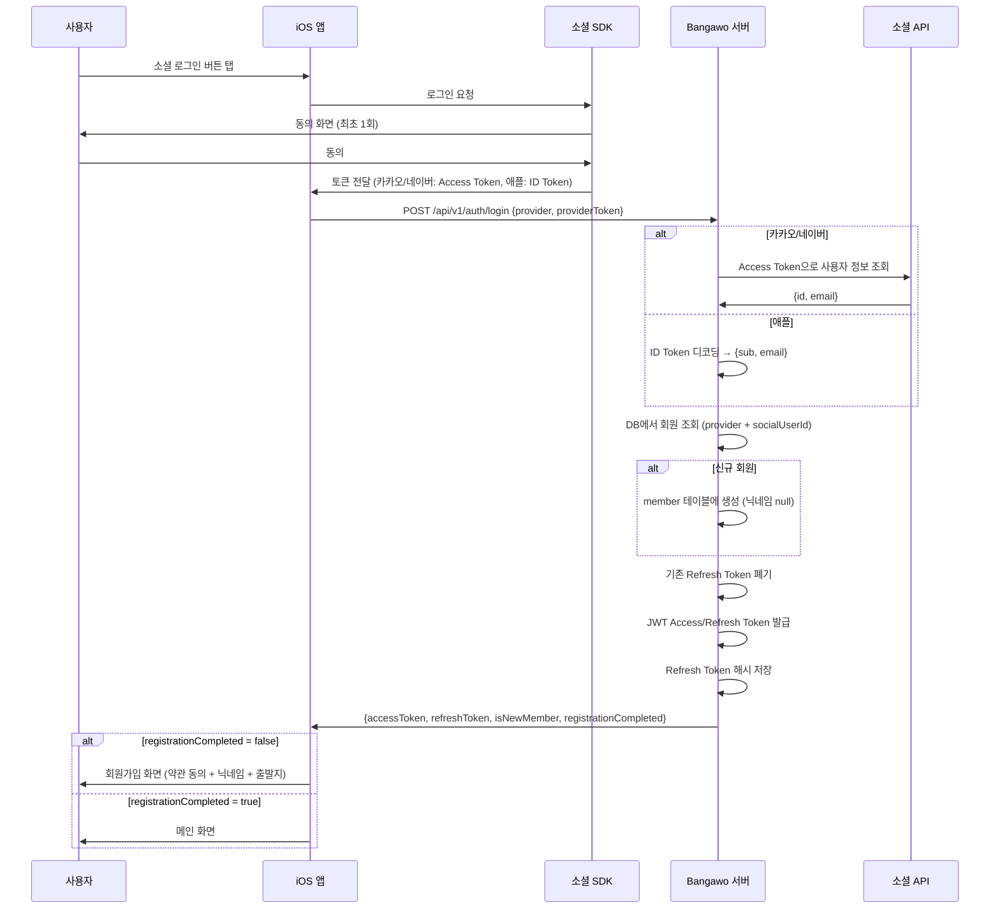

# 소셜 로그인 구현 문서

## 개요

iOS 앱에서 카카오/네이버/애플 SDK로 로그인 → 서버에 토큰 전달 → 서버가 검증 후 JWT 발급.

---

## 전체 플로우



---

## API 명세

### 1. 소셜 로그인

```
POST /api/v1/auth/login
Content-Type: application/json

{
    "provider": "KAKAO",        // KAKAO | NAVER | APPLE
    "providerToken": "xxx"      // 카카오/네이버: Access Token, 애플: ID Token
}
```

**응답 (200)**
```json
{
    "accessToken": "eyJ...",
    "refreshToken": "eyJ...",
    "isNewMember": true,
    "registrationCompleted": false
}
```

| 필드 | 설명 |
|---|---|
| `accessToken` | API 호출용 JWT (1시간) |
| `refreshToken` | 토큰 갱신용 JWT (30일) |
| `isNewMember` | 이번 요청으로 최초 생성된 회원인지 |
| `registrationCompleted` | 회원가입 완료 여부 (닉네임 설정 완료 = true) |

**iOS 분기 로직:**
- `registrationCompleted = false` → 회원가입 화면으로 이동
- `registrationCompleted = true` → 메인 화면으로 이동

### 2. 토큰 갱신

```
POST /api/v1/auth/refresh
Content-Type: application/json

{
    "refreshToken": "eyJ..."
}
```

**응답 (200)**: 로그인과 동일한 형태

### 3. 로그아웃

```
POST /api/v1/auth/logout
Authorization: Bearer {accessToken}
```

**응답 (200)**: 빈 바디. 해당 회원의 모든 Refresh Token 폐기.

---

## 공급자별 토큰 검증 방식

| 공급자 | iOS가 전달하는 것 | 서버가 하는 것 |
|---|---|---|
| 카카오 | Access Token | `kapi.kakao.com/v2/user/me` API 호출 → 사용자 정보 조회 |
| 네이버 | Access Token | `openapi.naver.com/v1/nid/me` API 호출 → 사용자 정보 조회 |
| 애플 | ID Token (JWT) | 토큰 payload Base64 디코딩 → sub(사용자 ID), email 추출 |

---

## 인증 헤더 사용법

로그인 이후 모든 API 호출 시:
```
Authorization: Bearer {accessToken}
```

토큰 만료 시 → refresh API로 갱신.
갱신 토큰도 만료 시 → 다시 소셜 로그인.

---

## DB 테이블

### member
소셜 로그인 시 생성. 닉네임이 null이면 회원가입 미완료 상태.

### refresh_token
로그인/갱신 시 해시 저장. 로그인 시 기존 토큰 폐기 후 새로 발급.
로그아웃 시 해당 회원의 모든 토큰 폐기.

---

## 파일 구조

```
auth/
├── domain/                              # 비즈니스 로직
│   ├── Member.java                      # 회원 도메인
│   ├── MemberStatus.java                # ACTIVE / SUSPENDED / WITHDRAWN
│   ├── MemberRepository.java            # 저장소 인터페이스
│   ├── RefreshToken.java                # 토큰 도메인 (유효성 판단, 폐기)
│   ├── RefreshTokenRepository.java      # 저장소 인터페이스
│   └── SocialProvider.java              # KAKAO / NAVER / APPLE
├── application/                         # 서비스
│   ├── AuthService.java                 # 로그인/갱신/로그아웃 오케스트레이션
│   ├── SocialAuthClient.java            # 소셜 인증 인터페이스
│   └── SocialUserInfo.java              # 소셜 사용자 정보 (record)
├── infrastructure/
│   ├── persistence/                     # DB
│   │   ├── MemberJpaEntity.java
│   │   ├── MemberJpaRepository.java
│   │   ├── MemberRepositoryImpl.java
│   │   ├── MemberMapper.java
│   │   ├── RefreshTokenJpaEntity.java
│   │   ├── RefreshTokenJpaRepository.java
│   │   ├── RefreshTokenRepositoryImpl.java
│   │   └── RefreshTokenMapper.java
│   └── social/                          # 외부 API
│       ├── KakaoAuthClient.java
│       ├── NaverAuthClient.java
│       └── AppleAuthClient.java
└── presentation/
    ├── AuthController.java              # API 진입점
    └── dto/
        ├── LoginRequest.java
        ├── LoginResponse.java
        └── RefreshRequest.java
```
